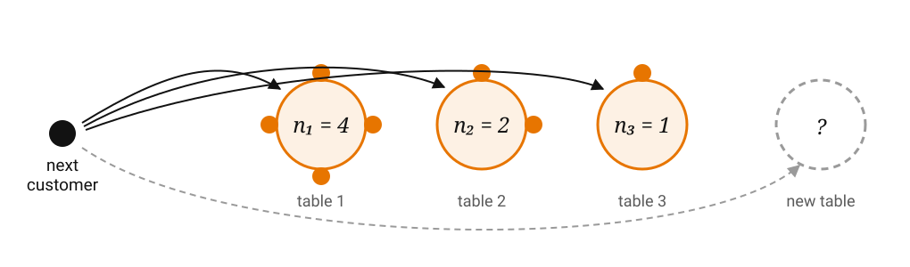

<!-- _class: lead -->

# The Fractional Distribution and Tilted Stable Law

## From the Chinese Restaurant to Synthetic Regime Data

**Two "elements" generate the fractional distributions that we can train regime models on**

## Stephen Lihn (2026)

<span class="small">Source: *Fractional Distributions* (fracdist), Ch. 1.2, 6, 7, 12, 13<br>Reference implementation: `github.com/slihn/gas-impl`</span>

###  v19

---

## The challenge

Financial time series is not long enough for machine learning models.
We need to use **synthetic** data for pre-training.

Challenge of the data generator:

- Gaussian emissions make the problem **too easy** — every model wins.
- Student-$t$ gives fat tails, but only **one** knob (df) and **no skew**.
- When tails are **too fat**, we need to clip the tails.


---

## Why this talk

The fractional distribution is a reparameterized **tilted stable law** $T_{\alpha,\beta}^{-\gamma}$ — 
The law arises as the $\alpha$-diversity limit of the Pitman–Yor process. So the random variate and its PDF rest on a **solid stochastic process**, not on a convenient functional form: the tails, the moments and the sampler are all consequences of that one object.


**GAS-SN** is the new two-sided distribution for return simulation. It gives three independent knobs — $\alpha$ (stability/tail), $k$ (degrees of freedom), $\beta$ (skew). 

- It is more flexible than a truncated Student-$t$ ($\alpha=1$, $\beta=0$).
- It converges to the skew-normal distribution naturally: $k \to \infty$, $\alpha \to 2$.

We benchmark regime-detection models — Mixture-VAE, Jump, KMeans++, Gaussian-HMM — on **synthetic** data, generated by **GAS-SN**, mixed by two-state HMM, with known regime labels $S_t$.


---

## Roadmap

1. The **tilted stable law** $T_{\alpha,\beta}$ and its Pitman–Yor origin — §1.2
2. The **inverse tilted stable law** $T_{\alpha,\beta}^{-\gamma}$: one element, eight distributions
3. The **fractional gamma**, and why it *is* the inverse tilted stable law — Ch. 6
4. **Kanter's method**: how we actually sample it — Lemma 6.2
5. **Fractional Chi** → **GAS-SN**: the second element is Selective Sampling — Ch. 7, 12
6. From random variates to **synthetic regime data**: `generate_hmm_data` → `GAS_SN_Comparator`
7. **Regime-detection** results, and what the tails do to classical models

---

## The element: the tilted stable law

> "The most fundamental and elegant representation is based on the **Tilted Stable law (TS)**."

It arose from Pitman & Yor's study of the **Poisson–Dirichlet** distribution.

$$T^{-\alpha}_{\alpha,\beta} = \left(T_{\alpha,\beta}\right)^{-\alpha}$$

- $\alpha \in [0,1]$ — the **stability index**
- $\beta \ge 0$ — the power of the **polynomial tilt**
- $L_\alpha := T_{\alpha,0}$ — the stable law with no tilt

The polynomial tilt $\beta$ in the density:

$$f_{T_{\alpha,\beta}}(x) \;\propto\; x^{-\beta} L_\alpha(x), \qquad x>0$$

where $L_\alpha(x)$ is the one-sided stable density.

---

## Where it comes from

### The Chinese restaurant process (CRP), one customer at a time

$K_n$ tables occupied after $n$ customers; $n_j$ customers already at table $j$:

- Choose a large table to join? $\Pr(\text{join table } j) =$ $\displaystyle \frac{n_j - \alpha}{\beta + n}$ $\longrightarrow$ Preferential attachment

- Open a new table? $\Pr(\text{new table} \mid K_n) =$ $\displaystyle \frac{\beta + \alpha K_n}{\beta + n}$ $\longrightarrow$ Diversity



---

## CRP is one representation of the Pitman-Yor process

$K_n$ tables occupied after $n$ customers; $n_j$ customers already at table $j$:

$$\Pr(\text{join table } j) = \frac{n_j - \alpha}{\beta + n}, \qquad
\Pr(\text{new table} \mid K_n) = \frac{\beta + \alpha K_n}{\beta + n}$$

- $\alpha$ plays a **discount** role — larger $\alpha$ discounts the pull of existing tables.
- $\beta$ is a **baseline strength** for creating a new table, independent of $n$ and $K_n$.

The **$\alpha$-diversity limit** is:

$$\frac{K_n}{n^{\alpha}} \longrightarrow T^{-\alpha}_{\alpha,\beta}$$


---


## Three parameter tilted stable law: $\mathrm{TS}(\alpha,\beta,\gamma)$

The superscript (exponent) is generalized to $T^{-\gamma}_{\alpha,\beta}$ with $\gamma \in \mathbb{R}$:

$$\mathrm{TS}(\alpha, \beta, \gamma) \;:=\; T^{-\gamma}_{\alpha,\beta} = (T_{\alpha,\beta})^{-\gamma}$$

- $\gamma > 0$ — represents a **local time** process
- $\gamma < 0$ — represents a **volatility** process

The **bridge** to the fractional distribution -
> "This three-parameter distribution law is **identical to our fractional gamma distribution** with a different parameterization."

---

## Table 1 — One element, eight distributions

> "$T_{\alpha,\beta}^{-\gamma}$ is the **element** that builds all one-sided distributions."


| Fractional distribution | §     | Notation | $\alpha$ | $\beta$ | $\gamma$ | scale |
|---|---|---|---|---|---|---|
| One-sided stable | 4.2 | $L_\alpha$ (aka $T_\alpha$) | $\alpha$ | 0 | $-1$ | 1 |
| M-Wright / Mittag-Leffler | 3.4 | $M_\alpha$ | $\alpha$ | 0 | $\alpha$ | 1 |
| **Fractional gamma** | 6.5 | $N_\alpha(\sigma,d,p)$ | $\alpha$ | $\alpha d/p$ | $\alpha/p$ | $\sigma$ |
| **Fractional chi (FCM)** | 7.2.1 | $\chi_{\alpha,k}$, $k>0$ | $\alpha/2$ | $(k{-}1)/2$ | $1/2$ | $\sigma_{\alpha,k}$ |
| Inverse FCM | 9.4 | $\chi^{\dagger}_{\alpha,k}$ | $\alpha/2$ | $(k{-}1)/2$ | $-1/2$ | $\sigma^{-1}_{\alpha,k}$ |
| Characteristic FCM | 7.4.2 | $\chi_{\alpha,-k}$ | $\alpha/2$ | $k/2$ | $-1/2$ | $\sigma^{-1}_{\alpha,k}$ |
| FCM2 | 7.5.1 | $\chi^2_{\alpha,k}$ | $\alpha/2$ | $(k{-}1)/2$ | $1$ | $\sigma^2_{\alpha,k}$ |
| Characteristic FCM2 | 7.5.1 | $\chi^2_{\alpha,-k}$ | $\alpha/2$ | $k/2$ | $-1$ | $\sigma^{-2}_{\alpha,k}$ |


* Notice the last line - $\chi^2_{\alpha,-k} =$ $1/T_{\alpha/2,k/2}$. It is just inverse of a two-parameter tilted stable law.

---

## Ch. 6 — FG: the fractional gamma

$$N_\alpha(x;\sigma,d,p) \;:=\; C\left(\frac{x}{\sigma}\right)^{d-1} F_\alpha\!\left(\left(\frac{x}{\sigma}\right)^{p}\right), \qquad x \ge 0$$

where $F_\alpha(x) = W_{-\alpha,0}(-x) = \alpha x M_\alpha(x)$ is the Wright function of the second kind.

- $\alpha \in [0,1]$ — shape of the Wright function
- $\sigma$ — scale; $p$ — tail shape ($p \neq 0$, $dp \ge 0$); $d$ — degrees of freedom

$$C = \frac{|p|}{\sigma}\,\frac{\Gamma(\alpha d/p)}{\Gamma(d/p)} \quad (\alpha \neq 0,\, d \neq 0)$$

**FG is the fractional extension of the generalized gamma (GG)**: replacing $e^{-(x/a)^p}$ by the Wright function $F_\alpha$. GG is recovered at $\alpha = 0$, and — more usefully — at $\alpha = \tfrac12$, which is the line that "leads to the fractional extension of the $\chi$ distribution."

---

## §6.5 — FG *is* the inverse tilted stable law

> "We will show that the FG random variable is **exactly the re-parametrized inverse tilted stable variable**."

Let $X \sim N_\alpha(\sigma,d,p)$. Then

$$\boxed{\;X = \sigma\, T^{-\alpha/p}_{\alpha,\;\alpha d/p}\;}$$

i.e. $\;\beta = \alpha d/p\;$ and $\;\gamma = \alpha/p$.

This is the most important finding of the work. Everything downstream — FCM, FCM2, fractional $F$, GSaS, GAS-SN — inherits both its **analytics** (Mellin transform, moments) and its **sampler** from this one line.

---

## Lemma 6.2 — Sampling by modified Kanter's method

$$T_{\alpha,\beta} = A_\alpha(Q_\beta)\, G_\beta^{-c}, \qquad c = \frac{1-\alpha}{\alpha}$$

1. $A_\alpha(q)$ — the **Zolotarev function**
2. $Q_\beta$ — the tilted angle, with density on $(0,1)$
$$f_{Q_\beta}(q) = I_\beta A_\alpha(q)^{-\beta}, \qquad I_\beta = \frac{\Gamma(1+\beta)\Gamma(1+c\beta)}{\Gamma(1+\beta/\alpha)}$$

3. $G_\beta \sim \mathrm{Gamma}(1 + c\beta,\ \text{scale}=1)$

Then the inverse variable $U$, and the FG variable $X$, are

$$U = T^{-\alpha}_{\alpha,\beta} = A_\alpha(Q_\beta)^{-\alpha}\, G_\beta^{\,1-\alpha}, \qquad X = \sigma\, U^{1/p}$$

**Two draws and a closed-form transform. No numerical CDF inversion.**

---

## Ch. 7 — FCM: The fractional $\chi$-mean

$$\chi_{\alpha,k}(x) := N_{\alpha/2}\big(x;\ \sigma = \sigma_{\alpha,k},\ d = k-1,\ p = \alpha\big), \qquad
\sigma_{\alpha,k} = \frac{|k|^{1/2 - 1/\alpha}}{\sqrt{2}}$$

Apply $\beta = \alpha d/p$, $\gamma = \alpha/p$ with $\alpha \to \alpha/2$, $d = k-1$, $p = \alpha$:

$$\boxed{\;\chi_{\alpha,k} = \sigma_{\alpha,k}\, T^{-1/2}_{\alpha/2,\ (k-1)/2}\;}\qquad \text{(Sec. 7.2.1)}$$

which is exactly **the FCM row of Table 1**. 

Note $\alpha \in (0,2)$ here, while the element $T$ needs $\alpha \in (0,1)$ — the halving $\alpha \to \alpha/2$ is what reconciles them.

---

## The second element: Selective Sampling

One-sided elements give tails. **Skewness needs a second mechanism** (§1.2, §14.4).

Take $X_0 \sim N_d(0,\bar\Omega)$, $X_1 \sim N(0,1)$, skew parameter $\beta \in \mathbb{R}^d$:

$$Z = \begin{cases} X_0 & \text{if } X_1 > \beta^{\intercal} X_0 \\[2pt] -X_0 & \text{otherwise} \end{cases}
\qquad\Longrightarrow\qquad Z \sim SN_d(0,\bar\Omega,\beta)$$

A two-sided distribution is then assembled as a **ratio** $Z / \mathrm{TS}(\cdot)$ or a **product** $Z \times \mathrm{TS}(\cdot)$.

> "The crown jewel is the skew multivariate elliptical distribution, based on the ratio $SN_d(0,\bar\Omega,\beta)/\chi_{\alpha,k}$."

---

## Ch. 12 — GAS-SN

**Definition 12.1.** Let $Z_0 \sim SN(0,1,\beta)$ and $V \sim \chi_{\alpha,k}$. Then

$$\boxed{\;Z = Z_0 / V \;\sim\; L_{\alpha,k}(\beta)\;}$$

$$L_{\alpha,k}(x;\beta) = 2\int_0^\infty \mathcal{N}(xs)\,\Phi_{\mathcal N}(\beta x s)\,\chi_{\alpha,k}(s)\, s\,ds$$

It is a **continuous Gaussian mixture** — one normal per value of the mixing variable $V$.

What it subsumes:

| Limit | Reduces to |
|---|---|
| $\beta = 0$ | GSaS $L_{\alpha,k}$ — the symmetric case |
| $\alpha = 1$ | Azzalini's **skew-$t$**: $T(\beta,k) = L_{1,k}(\beta)$ |
| $\alpha \to 2$ or $k \to \infty$ | the normal distribution |

$\alpha$ and $k$ control the tail **independently** — that is the modelling gain over Student-$t$.

---

## The full sampling chain, in code

```
GAS_SN(alpha, k, beta, loc, scale).rvs(size)
   └─ GAS_SN_Std._rvs:      z0 = SN_Std(beta)._rvs(size)      # selective sampling
                            v  = fcm.rvs(size)                # the element
                            return z0 / v                     # Definition 12.1
        └─ frac_chi_mean(alpha, k)  ->  frac_gamma(alpha/2, sigma_ak, k-1, alpha)
             └─ fractional_gamma_gen._rvs  ->  kanter_rvs
                  └─ get_tilted_stable3(alpha, beta=alpha*d/p, gamma=alpha/p)
                       └─ TitledStable3.rvs:   exp( c*gamma*log(E) - gamma*log A_alpha(Q) )
```

Each arrow is a line from the book: Def. 12.1 → (7.4) → (6.7) → Lemma 6.2.

The `scipy.stats` `rv_continuous` machinery is **bypassed** for sampling — `_rvs` is overridden so we never touch the generic CDF-inversion path (`legacy_rvs`, kept only for reference, is "very slow").

---

## Does it actually work? Verified numbers

For $\alpha = 1.1$, $k = 2.75$ — the parameters used in the benchmark:

| Check | Theory | Sample |
|---|---|---|
| $\mathbb{E}[X]$, FCM | 0.853499 | 0.851921 |
| $\mathrm{sd}(X)$, FCM | 0.337524 | 0.337214 |
| $\mathbb{E}[X^{-1}]$ | 1.462901 | 1.466850 |

- 200,000 Kanter draws in **0.05 s**
- One-sample KS against the analytic FCM CDF ($n=400$): $D = 0.0252$, $p = 0.956$
- **100,008 GAS-SN draws in 0.06 s**

That last number is the one that matters operationally: the generator is *not* the bottleneck in the benchmark — a 500-epoch VAE fit is.

---

## From variates to a *series*

`data_code/synthetic_data.py :: generate_hmm_data(emission_dist='gassn')`

1. **State path.** An `hmmlearn` `CategoricalHMM` with `emissionprob_ = I` emits the hidden path $\{S_t\}$ directly — transition matrix `[[0.96, 0.04], [0.04, 0.96]]`, so regimes persist ~25 days.
2. **Emissions.** One `GAS_SN(alpha, k, beta, loc, scale)` per state, straddling zero at $\pm\text{loc}$.
3. **Draw per state.** For each state, draw exactly $\#\{t : S_t = j\}$ values — vectorized, in chunks.
4. **Clip by rejection.** Samples outside $\pm\,$`clip_factor`$\,\times$ sd are rejected and redrawn.

**On `clip_factor`:** GAS-SN tails are heavy enough that unclipped draws would dominate the sample variance and make the "regimes" trivially separable by magnitude alone. We use `clip_factor=12.0` — much wider than the `10.0` used for Student-$t$, because these tails are better behaved in the body.

> The emissions are **i.i.d. within a state** — a deliberate simplification. The fractional Feller square-root process (Ch. 13) would generate $\{S_t\}$ as a *path* instead, adding volatility clustering.

---

## `GAS_SN_Comparator`

`compare/gassn.py` — the whole experiment as one object:

```python
cmp = GAS_SN_Comparator(
    T=100008, D=1, num_states=2, stay_prob=0.96,
    alpha=1.1, k=2.75, beta=0.0,      # the GAS-SN knobs
    loc=0.001, sd=0.003, clip_factor=12.0,
    window_size=500, batch_size=32, vae_epochs=500,
)
cmp.stats()      # moments, overall and per state
cmp.compare()    # -> balanced accuracy for every model
```

`generate` → `dataloaders` → `fit_{vae,jump,kmeans,hmm}` → balanced accuracy, with label-permutation alignment (`utils.metrics.balanced_accuracy` maximizes over all $k!$ label assignments, so a "flipped" clustering is not penalized).

$D = 1$ is enforced: the GAS-SN emission path is univariate.

---

## What the generated data looks like

$T = 100{,}008$, two states at $\mp 0.001$ with sd $0.003$:

| | $n$ | mean | sd | skew | kurtosis |
|---|---|---|---|---|---|
| all | 100,008 | 0.000024 | 0.005037 | 0.063 | **5.32** |
| state 0 | 49,428 | $-0.000997$ | 0.004924 | 0.058 | 5.79 |
| state 1 | 50,580 | 0.001021 | 0.004947 | 0.070 | 5.77 |

- Excess kurtosis **5.3** — and that is *after* clipping at $12\sigma$. The unclipped law has far heavier tails.
- Skew $\approx 0.06$ because we set $\beta = 0$; the residual is sampling noise.
- The regime signal is a **mean shift of $\pm 0.001$ against a sd of $0.005$** — a signal-to-noise ratio of 0.2. This is deliberately hard.

---

## Results at the benchmark's operating point

$\alpha = 1.1$, $k = 2.75$, $\beta = -0.1$, clip $= 12$ — balanced accuracy on the held-out test split:

| Model | Balanced accuracy | |
|---|---|---|
| **Mixture-VAE** | **0.680** (sd 0.013) | works |
| KMeans++ | 0.578 | at chance |
| Jump | 0.507 | at chance |
| Gaussian-HMM | 0.500 | `Model is not converging` |

Outcomes are **bimodal** — roughly 0.52 or 0.69 — so every number is a mean over replicates. A single run is not reproducible: `seed` fixes the state path $S_t$ but **not** the observations, because the Kanter sampler draws from an unseeded generator.

**This is one point in parameter space.** One slide per model on what happens when we move.

---

## Mixture-VAE — robust, but capped

| $k$ | 1.5 | 2.0 | 2.5 | 2.75 | 3.0 | 4.0 | 5.0 | 6.0 |
|---|---|---|---|---|---|---|---|---|
| mean | 0.608 | 0.602 | 0.669 | **0.680** | 0.661 | 0.695 | 0.691 | 0.699 |
| $p(>0.6)$ | 0.75 | 0.50 | 1.00 | 1.00 | 0.83 | 1.00 | 1.00 | 1.00 |

- **No cliff on any axis.** It sustains high-60s for $k \ge 2.5$; below that it *degrades* to ~0.60 rather than collapsing — still far above the 0.52 the baselines give there.
- $\alpha$ **flat** across **0.7–1.6** — a five-fold range of tail weight (kurtosis 10.4 → 2.0) with no trend. `clip_factor` makes **no difference at all**.
- **Ceiling ~0.70** however favourable the data.
- Noisiest of the four: across 64 fits, mean 0.652, sd 0.049, range 0.514–0.713. It adds its *own* unseeded randomness — weight init and shuffling — on top of the unseeded data.

---

## Jump — broken at the preset, best when tails thin

| $k$ | 1.5 | 2.0 | 2.75 | 4.0 | 6.0 |
|---|---|---|---|---|---|
| mean | 0.522 | 0.520 | 0.507 | **0.717** | **0.730** |

- **Above $k = 4$ it is the strongest model of the four** — 0.730 at $k=6$, sd 0.003, versus the VAE's 0.699.
- Wants the tails **cut**: clip $8 \to 0.700$, $10 \to 0.632$, $12 \to 0.509$, $14 \to 0.505$. A cliff between 10 and 12.
- $\alpha$ threshold at ~1.4–1.6 (0.508 $\to$ 0.709), higher than KMeans'.
- `jump_penalty` — the hardcoded 100.0 was the **worst of seven values** at $k=2.75$; but once $k \ge 4$, every penalty from 0.03 to 30 gives $p = 1.00$. A dead-zone-only lever.

**Why:** it estimates per-state means in its m-step, so retained outliers corrupt them.

---

## KMeans++ — never a capability problem

| $k$ | 1.5 | 2.0 | 2.75 | 4.0 | 6.0 |
|---|---|---|---|---|---|
| mean | 0.519 | 0.522 | 0.578 | 0.705 | 0.721 |

It splits on **`cstd_6`**, a volatility feature whose regime separation is $\approx -0.005$ — instead of the rolling means, whose separation is $0.83$. The two axes are within **3%** of each other as binary splits (0.63–0.65 variance explained), so the winner flips run to run.

$$\textbf{Restricted to the six mean features: } p = 1.00 \textbf{ at every setting, down to } \alpha=0.9,\; k=1.5$$

The signal was never lost — the unweighted Euclidean metric picked the wrong axis. $\alpha$ flips it at ~1.1–1.2, and clip must be $\ge 16$: the **opposite** of what Jump needs.

---

## What the sweep actually shows

**The ranking reverses at $k = 4$.** Below it only the VAE retains signal; above it all three work and Jump leads.

| axis | KMeans++ | Jump | **Mixture-VAE** |
|---|---|---|---|
| $k$ | flips at ~3–4 | flips at ~3–4 | **no cliff** — 0.61 at $k=1.5$ |
| $\alpha$ | flips at ~1.1–1.2 | flips at ~1.4–1.6 | **flat** across 0.7–1.6 |
| clip | needs $\ge 16$ | needs $\le 10$ | **indifferent** |

- The baselines fail for **unrelated** reasons — feature selection for KMeans, outlier contamination for Jump — so this is not one shared weakness.
- **No single `clip_factor` is fair to both**, and the benchmark's 12 breaks each of them.

**The VAE buys robustness, not peak accuracy — the only survivor at $k \le 3$, never the best at $k \ge 4$.**

---

## References

- **fracdist** — *Fractional Distributions*, Ch. 1.2 (elements & Table 1), Ch. 6 (FG and the inverse tilted stable law), Ch. 7 (FCM), Ch. 12 (GAS-SN).
- Pitman & Yor — Poisson–Dirichlet, the two-parameter CRP, and the $\alpha$-diversity limit.
- Devroye / Kanter / Zolotarev — the stable-law sampling representation behind Lemma 6.2.
- Azzalini (2013) — the skew-normal and skew-$t$ blueprint (selective sampling, $SN_d$).
- Nie, Mulvey, Poor, Yu & Huang (2026) — *Deep generative models meet statistical methods: a generalized framework for financial regime identification*, **Annals of Operations Research** (in press). Code: `github.com/yuqinie98/Mixture-VAE` — the model and benchmark this work builds on.

