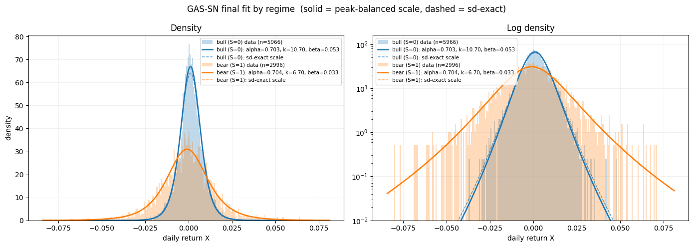

<!-- _class: lead -->

# The Fractional Distribution and Tilted Stable Law

## From the Chinese Restaurant to Synthetic Regime Data

**Two foundational elements in stochastic theory**
**The fractional distributions that we can train regime models on**

## Stephen Lihn (2026)

<span class="small">Source: *Fractional Distributions* (fracdist), Ch. 1.2, 6, 7, 12, 13<br>Reference implementation: `github.com/slihn/gas-impl`</span>

###  v55

---

## The challenge

Financial time series is often not long enough for machine learning models.
We need to use **synthetic** data for pre-training.

Challenge of the existing data generator:

- Gaussian emissions make the problem **too easy** — every model wins.
- Student-$t$ gives fat tails, but only **one** knob (df) and **no skew**.
- When tails are **too fat**, we need to clip the tails (clip_factor).


---

## Why this talk

The fractional distribution is a reparameterized three-parameter **tilted stable law** $T_{\alpha,\beta}^{-\gamma}$ — 
The law arises as the $\alpha$-diversity limit of the Pitman–Yor process. So the random variate and its PDF rest on a **solid stochastic process**, not on a convenient functional form: the tails, the moments and the sampler are all consequences of that one object.


**GAS-SN** is the new two-sided distribution for return simulation. It gives three independent knobs — $\alpha$ (stability/tail), $k$ (degrees of freedom), $\beta$ (skew). 

- It is more flexible than a truncated Student-$t$ ($\alpha=1$, $\beta=0$).
- It converges to the skew-normal distribution naturally: $k \to \infty$, $\alpha \to 2$.

We benchmark regime-detection models — Mixture-VAE, Jump, KMeans++, Gaussian-HMM — on **synthetic** data, generated by **GAS-SN**, mixed by two-state HMM, with known regime labels $S_t$.


---

## Roadmap

1. The **two-parameter tilted stable law** $T_{\alpha,\beta}$ and its Pitman–Yor origin — §1.2
2. The **three-parameter tilted stable law** $T_{\alpha,\beta}^{-\gamma}$: one element, eight distributions
3. The **fractional gamma**, and why it *is* the tilted stable law — Ch. 6
4. **Kanter's method**: how we actually sample it — Lemma 6.2
5. **GAS-SN**: the selective sampling is the second element — Ch. 7, 12
6. From random variates to **synthetic regime data**: `generate_hmm_data` → `GAS_SN_Comparator`
7. **Regime-detection** pre-training results, and what the tails do to classical models

---

## The two-parameter tilted stable law

It arose from Pitman & Yor's study of the **Poisson–Dirichlet** distribution. 

$$T^{-\alpha}_{\alpha,\beta} = \left(T_{\alpha,\beta}\right)^{-\alpha}$$

- $\alpha \in [0,1]$ — the **stability index**
- $\beta \ge 0$ — the power of the **polynomial tilt**
- $L_\alpha := T_{\alpha,0}$ — the stable law with no tilt, often characterized by the Laplace transform:

$$\mathbb{E}\left[e^{-t L_\alpha}\right] = e^{-t^{\alpha}}, \qquad t \ge 0.$$

The polynomial tilt $\beta$ is added to the density $L_\alpha(x)$ of $L_\alpha$ as

$$f_{T_{\alpha,\beta}}(x) \;\propto\; x^{-\beta} L_\alpha(x), \qquad x>0.$$


---

## Where it comes from - the single-parameter model

### The Chinese restaurant process (CRP), one customer at a time

Given $\alpha \in [0,1]$, $K_n$ tables occupied after $n$ customers; $n_j$ customers already at table $j$:

- Choose a large table to join? $\Pr(\text{join table } j) = (n_j - \alpha) / n$ $\longrightarrow$ Preferential attachment.
- Open a new table? $\Pr(\text{new table} \mid K_n) = \alpha K_n / n$ $\longrightarrow$ Diversity, creativity (or anti-social).
- The **$\alpha$-diversity limit** is $\frac{K_n}{n^{\alpha}} \longrightarrow M_{\alpha} := L^{-\alpha}_{\alpha}$ (the inverse stable law)


---

## The two-parameter Pitman-Yor process in CRP representation

$K_n$ tables occupied after $n$ customers; $n_j$ customers already at table $j$:

$$\Pr(\text{join table } j) = \frac{n_j - \alpha}{\beta + n}, \qquad
\Pr(\text{new table} \mid K_n) = \frac{\beta + \alpha K_n}{\beta + n}$$

- $\alpha$ plays a **discount** role — larger $\alpha$ discounts the pull of existing tables.
- $\beta$ is a **baseline strength** for creating a new table, independent of $n$ and $K_n$.

The **$\alpha$-diversity limit** is:

$$\frac{K_n}{n^{\alpha}} \longrightarrow T^{-\alpha}_{\alpha,\beta}$$

(Combinatorial Stochastic Processes, Pitman, 2002)

---


## The three-parameter tilted stable law: $\mathrm{TS}(\alpha,\beta,\gamma)$

The superscript (exponent) is generalized to $T^{-\gamma}_{\alpha,\beta}$ with $\gamma \in \mathbb{R}$ in Devroye (2009):

$$\mathrm{TS}(\alpha, \beta, \gamma) \;:=\; T^{-\gamma}_{\alpha,\beta} = (T_{\alpha,\beta})^{-\gamma}$$

- $\gamma > 0$ — represents a **local time** process
- $\gamma < 0$ — represents a **volatility** process

The **bridge** to the fractional distribution -
> "This three-parameter distribution law is **identical to our fractional gamma distribution** with a different parameterization."

---

## One foundational element, eight one-sided distributions

### $T_{\alpha,\beta}^{-\gamma}$ is the foundational **element** that builds all one-sided distributions.


| Fractional distribution | §     | Notation | $\alpha$ | $\beta$ | $\gamma$ | scale |
|---|---|---|---|---|---|---|
| One-sided stable | 4.2 | $L_\alpha$ (aka $T_\alpha,0$) | $\alpha$ | 0 | $-1$ | 1 |
| M-Wright / Mittag-Leffler | 3.4 | $M_\alpha$ | $\alpha$ | 0 | $\alpha$ | 1 |
| **Fractional gamma** | 6.5 | $N_\alpha(\sigma,d,p)$ | $\alpha$ | $\alpha d/p$ | $\alpha/p$ | $\sigma$ |
| **Fractional chi (FCM)** | 7.2.1 | $\chi_{\alpha,k}$, $k>0$ | $\alpha/2$ | $(k{-}1)/2$ | $1/2$ | $\sigma_{\alpha,k}$ |
| Inverse FCM | 9.4 | $\chi^{\dagger}_{\alpha,k}$ | $\alpha/2$ | $(k{-}1)/2$ | $-1/2$ | $\sigma^{-1}_{\alpha,k}$ |
| Characteristic FCM | 7.4.2 | $\chi_{\alpha,-k}$ | $\alpha/2$ | $k/2$ | $-1/2$ | $\sigma^{-1}_{\alpha,k}$ |
| FCM2 | 7.5.1 | $\chi^2_{\alpha,k}$ | $\alpha/2$ | $(k{-}1)/2$ | $1$ | $\sigma^2_{\alpha,k}$ |
| Characteristic FCM2 | 7.5.1 | $\chi^2_{\alpha,-k}$ | $\alpha/2$ | $k/2$ | $-1$ | $\sigma^{-2}_{\alpha,k}$ |


* In the last line: $\chi^2_{\alpha,-k}$ is inverse of $T_{\alpha/2,k/2}$. The reparametrization is most obvious here.

---

## FG: The fractional gamma — Overview (Ch. 6)

$$N_\alpha(x;\sigma,d,p) \;:=\; C\left(\frac{x}{\sigma}\right)^{d-1} F_\alpha\!\left(\left(\frac{x}{\sigma}\right)^{p}\right), \qquad x \ge 0$$

where $F_\alpha(x) := W_{-\alpha,0}(-x) = \alpha x M_\alpha(x)$ is the Wright function of the second kind.

- $\alpha \in [0,1]$ — shape of the Wright function
- $\sigma$ — scale; $p$ — tail shape ($p \neq 0$, $dp \ge 0$); $d$ — degrees of freedom

**FG is the fractional extension of the generalized gamma** $\text{GG}(a,d,p)$: replacing $e^{-(x/a)^p}$ by the Wright function $F_\alpha((x/\sigma)^p)$. GG is recovered at $\alpha = 0$, and — more usefully — at $\alpha = \tfrac12$, which is the line that "leads to the fractional extension of the $\chi$ distribution."

$$C = \frac{|p|}{\sigma}\,\frac{\Gamma(\alpha d/p)}{\Gamma(d/p)} \quad (\alpha \neq 0,\, d \neq 0)$$

---

## FG *is* the tilted stable law (§6.5)

### The FG random variable is exactly the re-parametrized tilted stable variable.

Let $X \sim N_\alpha(\sigma,d,p)$. Then

$$\boxed{\;X = \sigma\, T^{-\alpha/p}_{\alpha,\;\alpha d/p}\;}$$

i.e. $\;\beta = \alpha d/p\;$ and $\;\gamma = \alpha/p$.

This is the most important finding of the work. Everything downstream — FCM, FCM2, fractional $F$, GSaS, GAS-SN — inherits both its **analytics** (Mellin transform, moments) and its **sampler** from this one line.

---

## Sampling by modified Kanter's method (Lemma 6.2)

$$T_{\alpha,\beta} = A_\alpha(Q_\beta)\, G_\beta^{-c}, \qquad c = \frac{1-\alpha}{\alpha}$$

1. $A_\alpha(q)$ — the **Zolotarev function**
2. $Q_\beta$ — the tilted angle, with density on $(0,1)$
$$f_{Q_\beta}(q) = I_\beta A_\alpha(q)^{-\beta}, \qquad I_\beta = \frac{\Gamma(1+\beta)\Gamma(1+c\beta)}{\Gamma(1+\beta/\alpha)}$$

3. $G_\beta \sim \mathrm{Gamma}(1 + c\beta,\ \text{scale}=1)$

Then the inverse variable $U$, and the FG variable $X$, are

$$U = T^{-\alpha}_{\alpha,\beta} = A_\alpha(Q_\beta)^{-\alpha}\, G_\beta^{\,1-\alpha}, \qquad X = \sigma\, U^{1/p}$$

**Two draws and a closed-form transform. No numerical CDF inversion. Fast.**

---

## FCM: The fractional $\chi$-mean (Ch. 7)

$$\chi_{\alpha,k}(x) := N_{\alpha/2}\big(x;\ \sigma = \sigma_{\alpha,k},\ d = k-1,\ p = \alpha\big), \qquad
\sigma_{\alpha,k} = \frac{|k|^{1/2 - 1/\alpha}}{\sqrt{2}}$$

Apply $\beta = \alpha d/p$, $\gamma = \alpha/p$ with $\alpha \to \alpha/2$, $d = k-1$, $p = \alpha$:

$$\boxed{\;\chi_{\alpha,k} = \sigma_{\alpha,k}\, T^{-1/2}_{\alpha/2,\ (k-1)/2}\;}\qquad \text{(Sec. 7.2.1)}$$

which is exactly **the FCM row of Table 1**. 

Note $\alpha \in (0,2)$ here, while the element $T$ needs $\alpha \in (0,1)$ — the halving $\alpha \to \alpha/2$ is what reconciles them.

---

## The second element: selective sampling

One-sided elements give tails. **Skewness needs a second mechanism** (§1.2, §14.4).

Take $X_0 \sim N_d(0,\bar\Omega)$, $X_1 \sim N(0,1)$, skew parameter $\beta \in \mathbb{R}^d$. The skew-normal (SN) variable is

$$Z = \begin{cases} X_0 & \text{if } X_1 > \beta^{\intercal} X_0 \\[2pt] -X_0 & \text{otherwise} \end{cases}
\qquad\Longrightarrow\qquad Z \sim SN_d(0,\bar\Omega,\beta)$$

A two-sided distribution is assembled as a **ratio** $Z / \mathrm{TS}(\cdot)$ or a **product** $Z \times \mathrm{TS}(\cdot)$.

The **crown jewel** is the skew multivariate elliptical distribution, based on the ratio

$$SN_d(0,\bar\Omega,\beta)/\chi_{\alpha,k}.$$

---

## GAS-SN: the univariate two-sided skew distribution (Ch. 12)

Definition 12.1: Let $Z \sim SN(0,1,\beta)$ and $V \sim \chi_{\alpha,k}$. Then

$$\boxed{\;X = Z / V \;\sim\; L_{\alpha,k}(\beta)\;}$$

$$L_{\alpha,k}(x;\beta) = 2\int_0^\infty \mathcal{N}(xs)\,\Phi_{\mathcal N}(\beta x s)\,\chi_{\alpha,k}(s)\, s\,ds$$

It is a **continuous Gaussian mixture** — one normal per value of the mixing variable $V$.

What it subsumes:

| Limit | Reduces to |
|---|---|
| $\beta = 0$ | GSaS $L_{\alpha,k}$ — the symmetric case |
| $\alpha = 1$ | Azzalini's **skew-$t$**: $T(\beta,k) = L_{1,k}(\beta)$ |
| $\alpha \to 2$ or $k \to \infty$ | the normal distribution $\mathcal{N}(0,1)$ |

$\alpha$ and $k$ control the tail **independently** — that is the modelling gain over Student-$t$.

---

## The full sampling chain in GAS-SN

The python library is built according to the structure laid out above:

```
GAS_SN(alpha, k, beta, loc, scale).rvs(size)
   └─ GAS_SN_Std._rvs:      z0 = SN_Std(beta)._rvs(size)      # selective sampling
                            v  = fcm.rvs(size)                # the one-sided element
                            return z0 / v                     # Definition 12.1

        └─ fcm = frac_chi_mean(alpha, k)  ->  frac_gamma(alpha/2, sigma_ak, k-1, alpha)

             └─ fractional_gamma_gen._rvs  ->  kanter_rvs     # Kanter's method in Devroye (2009)

                  └─ get_tilted_stable3(alpha, beta=alpha*d/p, gamma=alpha/p)
                       └─ TitledStable3.rvs:   exp( c*gamma*log(E) - gamma*log A_alpha(Q) )
```

The `rvs` generator is *not* the bottleneck in the benchmark anymore.

- 100,008 GAS-SN draws in 0.06 s. Very fast.


---

## From variates to to synthetic regime data

Yuqi's Mixture-VAE code base:

`data_code/synthetic_data.py :: generate_hmm_data(emission_dist='gassn')`

1. **State path.** An `hmmlearn` `CategoricalHMM` with `emissionprob_ = I` emits the hidden path $\{S_t\}$ directly — transition matrix `[[0.96, 0.04], [0.04, 0.96]]`, so regimes persist ~25 days.
2. **Emissions.** One `GAS_SN(alpha, k, beta, loc, scale=0.003)` per state, straddling zero at $\pm\text{loc}$.
3. The emissions are **i.i.d. within a state** with Kanter's method.
4. **Draw per state.** For each state, draw exactly $\#\{t : S_t = j\}$ values — vectorized, in chunks.
5. **Clip by rejection.** Samples outside $\text{loc} \pm$ `clip_factor` $\times$ **scale** are rejected and redrawn.

**Why clip:** Undefined moments in small df for Student-$t$. Yuqi used `clip_factor=10.0`.

Enhancement:

`data_code/synthetic_data.py :: generate_hmm_data(emission_dist='gassn')`

---

## Cluster distance — between the two states

$$\text{cluster distance} = \frac{|\mathrm{median}_1 - \mathrm{median}_0|}{\mathrm{MAD}}, \qquad \mathrm{MAD} = 1.4826\,\mathrm{median}\big(|x - \mathrm{median}(x)|\big)$$

A better measure of the separation between the two states. It is like the loc/sd, but built from medians — It always exists, and **fat tails cannot move it**. 

Rationale: The code z-scores $X$ before building a feature, so **only the ratio reaches the model**.


---

## Global regime - Bull/bear states by jump model

**Emissions** — one GAS-SN per state, fitted to the S&P500 daily return, $8{,}962$ days, $1991$–$2026$:

| state | $\alpha$ | $k$ | $\beta$ | scale | loc | sd | $\kappa$ |
|---|---|---|---|---|---|---|---|
| **bull** ($S=0$), $66.6\%$ | $0.703$ | $\mathbf{10.70}$ | $0.053$ | $0.00984$ | $+0.00084$ | $0.00722$ | $1.86$ |
| **bear** ($S=1$), $33.4\%$ | $0.704$ | $\mathbf{6.70}$ | $0.033$ | $\mathbf{0.01984}$ | $-0.00119$ | $0.01672$ | $5.40$ |

<table class="layout"><tr><td width="34%">

**Transition**

$$\begin{pmatrix}0.9940 & 0.0060\\ 0.0116 & 0.9884\end{pmatrix}$$

stationary $(0.659,\, 0.341)$

$\mathbf{35}$ **bear episodes** over $\mathbf{35}$ years

</td><td width="66%">


</td></tr></table>

--- 

## Global regime - histogram vs theoretical



---

## Global regime - model output

$$\textbf{Cluster distance is only } 0.246 \textbf{ MAD — yet Jump scores } 0.91.$$

Feeding those emissions and that transition matrix through the same comparator, $T = 100{,}008$:


| model | balanced accuracy |
|---|---|
| **Jump** | $\mathbf{0.9117}$ |
| Mixture-VAE | $0.8536$ |
| KMeans++ | $0.8145$ |
| Gaussian-HMM | $0.5000$ |


- All three models score very high.
- **HMM fails outright** ($0.5000$, "model is not converging"), rather than merely trailing.

<small>Generated data tracks the fit closely: bear share $0.337$ (target $0.334$), per-state sd $0.00722 / 0.01675$ against the data's $0.00722 / 0.01672$, pooled $\kappa$ $9.96$ vs $10.77$. Jump ran at `jump_penalty` $=100$ to match the original notebook.</small>


---

## `GAS_SN_Comparator` — Large scale model efficacy test

`compare/gassn.py` — the whole experiment as one object:

```python
cmp = GAS_SN_Comparator(
    T=100008, D=1, num_states=2, stay_prob=0.96,
    alpha=1.1, k=2.75, beta=0.0,      # the GAS-SN knobs
    loc=0.001, scale=0.003, clip_factor=12.0,
    window_size=500, batch_size=32, vae_epochs=500,
    jump_penalty=100.0,               # per-model knobs -- also swept
    feature_set='all',                # 'all' 15 | 'means' 6 | 'scales' 8
    seed=42,                          # states, Kanter draws, weight init, shuffle
)
cmp.cluster_distance();  cmp.stats();  cmp.compare()
```

`generate` → `dataloaders` → `fit_{vae,jump,kmeans,hmm}` → balanced accuracy, with label-permutation alignment (`utils.metrics.balanced_accuracy` maximizes over all $k!$ label assignments, so a "flipped" clustering is not penalized). $D = 1$ is enforced: the GAS-SN emission path is univariate.

**`compare/sweep.py`** turns *any* of those keywords into a swept axis — one draw shared by every model, resumable, 19-way parallel. ~40k fits are collected from each model.

---

## What `clip_factor` actually clips

```python
# generate_hmm_data: shape = I * scale**2, so diag_std is the scale, not a std
diag_std = np.sqrt(np.diag(shape_))
lower, upper = loc - clip_factor * diag_std, loc + clip_factor * diag_std
```

The clip is still in the **scale** space. `clip_factor=12.0` produces:

| $k$ (at $\alpha=1.1$) | 1.5 | 2.0 | 2.75 | 4.0 | 6.0 | swing |
|---|---|---|---|---|---|---|
| clip, in **sd** | **5.5** | 6.3 | 7.2 | 8.2 | **9.0** | $+63\%$ |
| **cluster distance** | 0.481 | 0.501 | 0.521 | 0.541 | 0.566 | $+18\%$ |
| excess kurtosis $\kappa$ | 5.60 | 5.71 | 5.20 | 3.16 | 1.68 | $-70\%$ |

- The 63% change in sd: the sd is tail-driven, so the clip inflates it and $k$ deflates it.
- **Cluster distance** is a much more stable measure
- The models are affected by two factors - cluster distance and $\kappa$.

---

## What the generated data looks like in the benchmark

$T = 100{,}008$, two states at $\mp 0.001$ with scale $0.003$.
$\alpha = 1.1$, $k = 2.75$, $\beta = -0.1$, clip $= 12$, **cluster distance $= 0.522$** (sd 0.006).

| | $n$ | mean | sd | skew | kurtosis |
|---|---|---|---|---|---|
| all | 100,008 | $-0.000334$ | 0.005000 | $-0.120$ | **5.17** |
| state 0 | ~50,009 | $-0.001333$ | 0.004897 | $-0.131$ | 5.57 |
| state 1 | ~49,999 | 0.000665 | 0.004901 | $-0.126$ | 5.66 |

Averaged over 20 replicates (`seed=rep`). The regime signal is a **mean shift of $\pm 0.001$ against a std of $0.005$** — a signal-to-noise ratio of 0.2. This is deliberately hard.

- Excess kurtosis **5.2** — *after* clipping at $12 \times$ scale $= 0.036$, which is $\approx 7$ **std**, because the heavy tails lift the std to 0.005 from a scale of 0.003. The unclipped law has far heavier tails.
- Skew $\approx -0.12$ because we set $\beta = -0.1$. The estimate is noisy. It is added to test the skewness feature of GAS_SN. 

---

## Results at the benchmark's operating point

Balanced accuracy on the held-out test split, 10 replicates at `seed=rep` — which now pins the state path, the Kanter draws, the VAE's weight init *and* the loader shuffle, so a replicate reproduces end to end:

| Model | Balanced accuracy | $p(>0.6)$ | |
|---|---|---|---|
| **Mixture-VAE** | **0.651** (sd 0.040) | **0.80** | works |
| KMeans++ | 0.571 (sd 0.071) | 0.30 | at chance *on average* |
| Jump | 0.535 (sd 0.063) | 0.10 | at chance |
| Gaussian-HMM | 0.501 (sd 0.002) | 0.00 | `Model is not converging` |

- **Outcomes are bimodal, so only the VAE's mean is a typical outcome.** KMeans lands at 0.51–0.55 in 7 reps and 0.66–0.68 in 3; Jump sits at 0.50–0.52 in 8, with one 0.70. Their means are **mixing proportions** — read $p$, not the mean.
- The VAE is tighter: 0.65–0.69 in 7 reps, 3 low draws at 0.59–0.61.

**This is one point in parameter space.** Next, the law that explains all four — then model by model.


---


## Model efficacy — The two-term law for cluster distance **and** tail weight

For each $(\alpha,k)$ cell take its **cluster distance threshold** — where replicate-mean accuracy first reaches the target — and regress it on that cell's **excess kurtosis** $\kappa$:

$$\boxed{\text{cluster} \;\text{distance:}\;\;\text{threshold} \;=\; a \;+\; b \,\kappa\;}$$

- **Intercept $a$:** with Gaussian tails, how many robust widths apart the clusters must sit.
- **Slope $b$:** what one unit of excess kurtosis costs in extra cluster distance.
- **$\alpha$ and $k$ do not disappear into $\kappa$.** Pool the sweep's $140$ threshold cells over all four `clip` values and add them back, and they beat the law in $\kappa$ alone for **every** model — $F$-test $p = 1.5\times10^{-3}$ (Jump), $8.1\times10^{-6}$ (VAE), $8.3\times10^{-9}$ (KMeans). The line is a **reduced form, not a sufficient statistic**; *how far it gets you* is what $R^2$ measures — $0.99$ for Jump, $0.78$ for the VAE, $0.65$ for KMeans within a config.

Jump example: **`clip` and `jump_penalty` are *not* absorbed** — they **parameterize** the law rather than acting through $\kappa$. Pool over them and $R^2$ falls to $0.48$. It holds across models too: pooling all nine (model, `clip`) configs of the 5,184-fit sweep gives $R^2 = 0.56$, against $0.65$–$0.99$ *within* a config.

$$\textbf{A quoted law is } (a, b) \textbf{ plus its target and the } \kappa \textbf{ domain it was fitted over.}$$

<small>Target $0.65$ throughout: at $0.60$ the best-performing cells sit above target at every separation, never cross, and dropping them biases the fit toward the hard corners. The opposite failure also occurs and is reported separately — at `clip` $=20$ Jump **never reaches** $0.65$ in $2$ of $12$ cells (KMeans in $1$), so those laws are fitted on the cells that do cross.</small>


---

## The two-term law: The intercept transfers, the slope does not

Fitting the law **nine times at target $0.65$** — all three models $\times$ $3$ `clip` values, **all from the one 5,184-fit sweep** (`data/vae_sweep.csv`) — the two terms behave nothing alike:

| term | mean | spread | driven by |
|---|---|---|---|
| intercept $a$ | $0.313 \pm 0.021$ | $1.2\times$ | — essentially **nothing** |
| slope $b$ | $0.057 \pm 0.024$ | $\mathbf{4.1\times}$ | the **$(\alpha,k,\kappa)$ region sampled**, partly the model |

- **$a$ is close to a constant of the problem.** Nine model/config pairs across three quite different algorithms, and every one needs roughly **a third of a robust width** before it sees anything at Gaussian tails.
- **$b$ is what tails cost** — group means $0.081 / 0.057 / 0.035$ at clip $8 / 12 / 20$, non-overlapping. It looks like `clip` sets it; the next slide shows `clip` is not a setting the law responds to at all, but **which $(\alpha, k, \kappa)$ cells it can reach**. Models do differ genuinely though — at clip $8$ KMeans' slope is $63\%$ *above* Jump's, at clip $20$ it is $45\%$ *below*, and the **VAE sits $18\%$ under the pair at clip 12**.
- So model choice shows up in *which feature the tail is read through*, in $R^2$ — and, for the VAE, in $b$ itself.

<small>$a$ and $b$ are also stable across `jump_penalty`: on a separate penalty sweep (`data/jump_sweep.csv`, $19{,}200$ Jump fits over $5$ penalties $\times$ $3$ clips), the $18$ configs — $15$ Jump, plus $3$ penalty-invariant KMeans — gave $a = 0.277 \pm 0.034$, $b = 0.062 \pm 0.028$ — the same picture. And both statements hold **at a fixed target**: vary the target instead and the roles swap, $a$ running $0.24 \to 0.44$ over target $0.58 \to 0.72$ while $b$ barely moves. A law must be quoted with its target *and* its config.</small>

**Two things the law cannot say follow — the ruler it is measured in, and a case where the *feature* mattered more than the model.**

---


## `clip` is not a setting — it selects the $(\alpha, k, \kappa)$ region you sample

Regress the threshold on **everything at once** — all $140$ cells, four `clip` values, model fixed effects:

| term | coef | $t$ | $p$ |
|---|---|---|---|
| $\kappa$ | $+0.018$ | $+4.8$ | $3\times10^{-6}$ |
| $\alpha$ | $\mathbf{-0.200}$ | $\mathbf{-6.0}$ | $\mathbf{2\times10^{-8}}$ |
| $k$ | $\mathbf{-0.035}$ | $\mathbf{-5.4}$ | $\mathbf{3\times10^{-7}}$ |
| `clip` | $-0.002$ | $-1.0$ | $0.32$ |

- **`clip` is the one term that vanishes.** The three that survive are comparable in size: over their swept ranges $\alpha$ moves the threshold $-0.160$ MAD, $k$ $-0.141$, $\kappa$ $+0.165$.
- They are **not $\kappa$-curvature in disguise** — add $\kappa^2$ and $\kappa$'s own coefficient collapses to $t=-0.3$ while $\alpha$ and $k$ *strengthen* to $-8.2$ and $-7.4$. The generating parameters survive; the summary statistic does not.

$$\textbf{Quoting a law means naming } (\alpha, k, \kappa) \textbf{ — not the } \texttt{clip} \textbf{ that happened to reach them.}$$

<small>*Source: `data/vae_sweep.csv` + `data/vae_sweep_clip18.csv`; $6{,}912$ fits, $140$ threshold cells.* **Pre-registered falsification.** From clips $8/12/20$ we predicted clip $18$ would return $b\approx0.038$, $a\approx0.32$; the run gave $\mathbf{0.0380}$ and $\mathbf{0.3195}$. The *mechanism* first proposed for it — one concave threshold-vs-$\kappa$ curve, each `clip` fitting a different chord — **did not survive**: out-of-sample on the held-out clip-18 cells a straight line scored $R^2 = 0.686$ against the quadratic's $0.649$. The slope tracks `clip` because `clip` changes which $(\alpha,k,\kappa)$ cells are reachable, not because the curve bends. $140$ of $144$ cells crossed target, so survivorship is not driving it. **$\kappa$ a clip reaches** (median / top-5% avg): clip $8$: $2.1/4.6$ · $12$: $3.3/8.5$ · $18$: $5.2/15.0$ · $20$: $5.9/17.3$; whole sweep median $3.0$, top-5% $15.9$, max $18.6$ — and $\kappa$ past $\sim\!15\text{–}17$ is not a regime real financial data occupies, so no law here is evidence beyond that.</small>

---

## Why the slope never transferred — the two-term law is a *projection*

$\kappa$ is not a cause. It is one scalar summary of what $(\alpha, k)$ generate, so regressing on $\kappa$ **alone** leaves $\alpha$ and $k$ in the error term, where they are reabsorbed into $b$ as omitted-variable bias:

$$b_{\text{marginal}} \;=\; \underbrace{b_\kappa}_{\substack{\text{partial:}\\ \alpha,\,k\ \text{held fixed}}} \;+\; b_\alpha\,\delta_\alpha \;+\; b_k\,\delta_k$$

<small>*Same $140$ cells as the previous slide (`data/vae_sweep.csv` + `data/vae_sweep_clip18.csv`).* $\delta_\alpha,\ \delta_k$ are **auxiliary** slopes — $\alpha$ (or $k$) regressed **on $\kappa$** across that config's cells. They describe the **sweep grid**, not the law: $\delta_\alpha = \mathrm{corr}(\alpha,\kappa)\cdot\mathrm{sd}(\alpha)/\mathrm{sd}(\kappa)$. Raising `clip` shrinks them mostly by **stretching the $\kappa$ axis** — $\mathrm{sd}(\kappa)$ grows $3.8\times$ from clip $8$ to $20$ while the correlation weakens only $1.4\times$.</small>

Fit the **three-term law once** on all $140$ cells, then apply the formula config by config:

| `clip` | $\delta_\alpha$ | $\delta_k$ | predicted $b$ | observed $b$ |
|---|---|---|---|---|
| $8$ | $-0.230$ | $-0.414$ | $0.0823$ | $\mathbf{0.0796}$ |
| $12$ | $-0.111$ | $-0.345$ | $0.0533$ | $\mathbf{0.0571}$ |
| $18$ | $-0.053$ | $-0.226$ | $0.0360$ | $\mathbf{0.0378}$ |
| $20$ | $-0.045$ | $-0.192$ | $0.0329$ | $\mathbf{0.0330}$ |

**Every config to within $\pm 0.004$**, from a single pooled fit. And the confounding is the part that is *systematic*: the marginal $b$ falls **monotonically** $0.080\!\to\!0.057\!\to\!0.038\!\to\!0.033$ across the four clips, while the **partial** $b_\kappa$ — $\alpha$ and $k$ held fixed — shows **no trend**, scattering $0.025 / 0.014 / 0.027 / 0.026$. The $2.4\times$ spread in $b$ was never a property of tails; it was $\alpha$ and $k$ leaking into an under-specified regression.

$$\textbf{The intercept was never confounded. The slope always was.}$$

---

## Why MAD, not sd — the ruler the whole framework rests on

Every law in this deck is in **MAD units**. That choice is doing real work:

| ruler | $R^2$ of the two-term law | clip-invariance | defined at $k \le 2$? |
|---|---|---|---|
| median / **MAD** | $\mathbf{0.977}$ | $1.03\times$ | **yes** |
| mean / sd | $0.736$ | $1.36\times$ | **no** — the variance does not exist |

- **sd partially absorbs tail weight.** That makes it the better *single* ranking number (Spearman $0.97$ vs $0.87$) but leaves a muddier residual. MAD ignores tails entirely, so distance and tail weight come out **orthogonal and additive** — which is what makes a two-*term* law possible at all.
- At $k = 1.5$ the unclipped sd never settles ($\max|x| = 5589\times$ scale). **MAD is defined where the variance is not** — and $k \le 2$ is exactly the regime this benchmark is about.
- Its cost, stated plainly: a *worse* single ranker than even raw `loc` ($0.90$).

<small>*Sources: rulers compared on the original $1{,}760$-fit sweep (`data/jump_loc_sweep.csv` + `data/jump_moments.csv`); the Jump law from `data/jump_sweep.csv` at `clip`$=12$, `penalty`$=100$ — $16$ threshold cells.* Both rulers measured on the same cells at the same target. The Jump law MAD produces there — $0.312 + 0.0594\,\kappa$, $R^2 = 0.987$ — reproduces the original to $0.3\%$ on $a$ and $1\%$ on $b$.</small>

---

## `jump_penalty` — the price of a regime change

The Jump model's E-step is a backward DP over $\Gamma = \lambda\,(1 - I)$:

$$\min_{s}\;\sum_t \lVert y_t - \mu_{s_t}\rVert^2 \;+\; \sum_t \Gamma[s_{t-1},\, s_t]$$

so $\lambda$ is a **flat cost per switch** — a persistence prior priced in squared error rather than a transition probability. Its limits bracket the model: at **$\lambda \to 0$** the DP decouples and each $t$ goes to its nearest centroid, so the Jump model ***is* KMeans** — on identical draws at $\lambda = 0.03$ the two agree to $0.0008$ bac, $\mathrm{corr} = 0.9990$; at **$\lambda \to \infty$** switching is prohibitive and the sequence collapses to one state.

| $\lambda$ | $0.03$ | $0.3$ | $3$ | $\mathbf{30}$ | $100$ |
|---|---|---|---|---|---|
| mean bac | $0.7022$ | $0.7030$ | $0.7116$ | $\mathbf{0.7333}$ | $0.6888$ |
| mean threshold | $0.487$ | $0.487$ | $0.475$ | $\mathbf{0.431}$ | $0.517$ |

**The optimum is $30$ in all eleven slices** — every $k$, every $\alpha$, every `clip`. It never moves, so it is a constant to be set once, not tuned per dataset. Paired on identical draws, $\lambda = 30$ beats $\lambda = 100$ by $\mathbf{+0.0445}$ bac ($t = 43.3$, winning $93\%$ of $3{,}840$ draws).

$$\textbf{Every Jump number in this deck was run at } \lambda = 100 \textbf{ — the worst of the five.}$$

<small>*Source: `data/jump_sweep.csv` — $19{,}200$ Jump fits, $8$ `loc` $\times$ $4\,\alpha$ $\times$ $4\,k$ $\times$ $3$ `clip` $\times$ $5$ penalties $\times$ $10$ reps.* And that gap is *understated*: at $\lambda=30$ three cells sit above target across the whole `loc` grid and are dropped as non-crossing — its **best** cells — while $\lambda=100$ loses two for never reaching target, its **worst**. Both biases favour $100$. It follows that a fair $\lambda=30$ law needs a higher target ($\approx 0.70$), and laws at different targets do not compare — the intercept alone runs $0.24 \to 0.44$ over target $0.58 \to 0.72$. Note also that the effect is **U-shaped in $\log\lambda$**, so a linear penalty term in the threshold regression reads exactly zero: non-monotone is not absent.</small>

---

## KMeans++ — never a capability problem

**40,960 fits** (`data/kmeans_sweep.csv`): `loc` $\times\ \alpha\ \times k\ \times$ `clip` $\times$ **feature set**, 20 replicates each.

| feature set | $p(\text{bac}>0.65)$ | mean | max |
|---|---|---|---|
| 6 rolling **means** | **0.85** | 0.731 | 0.870 |
| all 15 | 0.75 | 0.702 | 0.877 |
| 8 **scale** features | **0.000** | 0.505 | **0.524** |

The scale features are the control: signal-free by construction — the states differ only in `loc`, never in scale — and across 10,240 fits not one exceeded $0.524$. So the failure is the wrong **axis**, not too many features.

$$\textbf{Restricted to the six means: } p(\text{bac}>0.65) = 1.00 \textbf{ at every } loc \ge 0.0010,\ \textbf{all } \alpha,\, k,\, \text{clip}$$

`clip` bites only while a scale axis survives: at the preset it runs $0.35 \to 0.95$ across clip $10\to20$ for all-15, and is **flat** for the means — unchanged whether read at $0.60$ or $0.65$.

<small>Raising the target from $0.60$ to $0.65$ costs the means set only its weakest separation: $p$ falls $1.00 \to 0.75$ at $loc = 0.0008$ and is $1.00$ above it. The scale control stays at exactly $0.000$ either way.</small>

---

## The three laws, side by side — one sweep, one draw per cell

| model | $a + b\,\kappa$ &nbsp;(target $0.65$, $\kappa$ to $8.5$) | $R^2$ |
|---|---|---|
| **Mixture-VAE** | $\mathbf{0.333} + \mathbf{0.0500}\,\kappa$ | 0.78 |
| Jump | $0.311 + 0.0609\,\kappa$ | **0.99** |
| KMeans++ | $\mathbf{0.281} + 0.0607\,\kappa$ | 0.65 |

**The VAE trades the worst intercept for the shallowest slope** — it needs *more* separation than either baseline at Gaussian tails, and *less* extra separation per unit of kurtosis.

- $a$: what the model needs when tails are Gaussian. KMeans is cheapest here, the VAE dearest.
- $b$: what each unit of kurtosis costs. The VAE is $18\%$ under the Jump/KMeans pair.

<small>*Source: `data/vae_sweep.csv` at `clip`$=12$ — one draw per cell, all three models on the same draw.* Jump's law here, $0.311 + 0.0609\kappa$, independently reproduces the penalty sweep's $0.312 + 0.0594\kappa$ (`data/jump_sweep.csv`, same `clip`/`penalty`) — different grid, different draws, agreeing to $0.3\%$ on $a$ and $2\%$ on $b$. The framework replicates.</small>

---

## So the ranking is not fixed — it crosses

Required cluster distance at target $0.65$, `clip` $=12$, from the three laws on the previous slide (`data/vae_sweep.csv`):

| $\kappa$ | VAE | Jump | KMeans | needs least |
|---|---|---|---|---|
| 0 | 0.333 | 0.311 | **0.281** | KMeans |
| 3 | 0.483 | 0.494 | **0.463** | KMeans |
| 5 | **0.583** | 0.616 | 0.584 | **VAE** |
| 8 | **0.733** | 0.798 | 0.766 | **VAE** |

$$\textbf{The VAE overtakes Jump at } \kappa = 2.04\textbf{, and KMeans at } \kappa = 4.93.$$

For scale, the benchmark's own $\kappa$ runs $1.6$ at $k=6$ to $5.3$ at $k=2$; across the sweep the median is $3.0$ and the **top-5% average is $15.9$**. Both crossovers therefore sit **inside** the swept range, not off at its edge — which is why the earlier single-point readings disagreed with each other.

---

## What the VAE actually buys — not accuracy, but a floor

Over all **1,728 fits per model** (`data/vae_sweep.csv`), the *means* are within two points of each other:

| model | mean bac | sd | $p(\text{bac}>0.6)$ | $\mathbf{p(\text{bac}<0.55)}$ | IQR |
|---|---|---|---|---|---|
| **Mixture-VAE** | 0.689 | **0.093** | **0.78** | **0.11** | **0.144** |
| KMeans++ | 0.683 | 0.118 | 0.72 | 0.28 | 0.257 |
| Jump | 0.673 | 0.123 | 0.66 | 0.33 | 0.265 |

$$\textbf{Same average accuracy. One third the failure rate.}$$

- The VAE lands near chance on **11%** of the grid; the baselines on **28–33%**. Its inter-quartile range is **44% narrower**.
- **"The ranking reverses at $k=4$" does not survive the full grid.** Averaged over separation, mean accuracy at `clip` $=12$ tracks within 2–3 points at *every* $k$ — at $k=6$: VAE 0.735, Jump 0.737, KMeans 0.740. The reversal was an artifact of reading one `loc`.
- What differs between these models is not where they peak. It is **how often they collapse** — which is exactly what a shallower slope buys.

---

## Summary — one law, three models, and what actually separates them

| model | $a + b\,\kappa$ &nbsp;($\kappa$ to $8.5$) | $R^2$ | mean bac | fails ($<0.55$) |
|---|---|---|---|---|
| **Mixture-VAE** | $0.333 + \mathbf{0.050}\,\kappa$ | 0.78 | **0.689** | **11%** |
| Jump (`penalty` $=100$) | $0.311 + 0.061\,\kappa$ | **0.99** | 0.673 | 33% |
| KMeans++, all 15 features | $\mathbf{0.281} + 0.061\,\kappa$ | 0.65 | 0.683 | 28% |

- **$a$ is nearly a constant of the problem.** **$b$ is not** — it is a *projection* coefficient, what tails cost over the $(\alpha,k,\kappa)$ region you measured it on. `clip` is not a knob the law responds to; it is **which region you sampled**. **$R^2$** ranks how threshold-like a model is.
- The baselines fail for **unrelated** reasons: Jump estimates per-state means in its m-step, so retained outliers corrupt them; KMeans splits on a signal-free volatility axis. Right *feature* beats right *model* — on the six mean features KMeans' slope falls to $0.018$.

$$\textbf{The VAE does not separate regimes better. It fails three times less often.}$$

<small>**Every "dominant knob" here turned out to be local** — each real where first measured, absent on the full grid: *"the ranking reverses at $k=4$"* (accuracy tracks within 2–3 points at every $k$); *"KMeans needs `clip` $\ge 16$"* (flat once pooled); *"the VAE has no threshold"* (it has one, $R^2=0.78$); *"the VAE is capped at $\sim 0.70$"* (max $0.866$). Before calling an axis flat or a model broken, check you are not reading it at one point on a second axis.</small>

---

## Provenance — which sweep backs which claim

| CSV | fits | models $\times$ reps | swept | **pinned** |
|---|---|---|---|---|
| `vae_sweep.csv` | $5{,}184$ | $3 \times 6$ | `loc`(8) $\alpha$(3) $k$(4) `clip`(8,12,20) | $\lambda=100$, `features=all` |
| `vae_sweep_clip18.csv` | $1{,}728$ | $3 \times 6$ | `loc`(8) $\alpha$(3) $k$(4) | `clip`$=18$, $\lambda=100$, `all` |
| `jump_sweep.csv` | $23{,}040$ | jump+kmeans $\times\ 10$ | `loc`(8) $\alpha$(4) $k$(4) `clip`(8,12,20) **$\lambda$(5)** | `features=all` |
| `kmeans_sweep.csv` | $40{,}960$ | kmeans $\times\ 20$ | `loc`(8) $\alpha$(4) $k$(4) `clip`(10,12,16,20) **`features`(4)** | — |
| `jump_loc_sweep.csv` + `jump_moments.csv` | $1{,}760$ | jump $\times\ 10$ | `loc`(11) $\alpha$(4) $k$(4) | `clip`$=12$, $\lambda=100$ |

$$\textbf{Each model's own knob is pinned at its default in every file except the one that studies it.}$$

- $\lambda = 100$ everywhere but `jump_sweep.csv` — and $100$ is the **worst** of the five penalties tested, so every headline Jump number is handicapped.
- `feature_set = all` everywhere but `kmeans_sweep.csv` — and `all` is $0.031$ bac below `means_x`, so KMeans is handicapped too, if less.
- The VAE's own knobs (`lamda_t`$=4.0$, `vae_epochs`$=500$, `vae_lr`$=10^{-3}$) are pinned in **every** file — never swept, at $274$ s/fit.

<small>Fixed across all runs: $2$ states, `stay_prob`$=0.96$, window $500$, `train/val`$=0.6/0.2$, `seed`$=$ replicate index (so all models in a cell see the *same* draw, and a cell is reproducible). Two sweeps carry no `model` column because they predate it and are Jump-only. Fit counts are rows on disk: `jump_sweep.csv` performed $38{,}400$ fits, but KMeans ignores $\lambda$ and was refitted identically five times per draw, so the $15{,}360$ duplicate rows were removed and one copy kept.</small>

---

## References

- **fracdist** — *Fractional Distributions*, Ch. 1.2 (elements & Table 1), Ch. 6 (FG and the inverse tilted stable law), Ch. 7 (FCM), Ch. 12 (GAS-SN).
- Pitman & Yor — Poisson–Dirichlet, the two-parameter CRP, and the $\alpha$-diversity limit.
- Devroye / Kanter / Zolotarev — the stable-law sampling representation behind Lemma 6.2.
- Azzalini (2013) — the skew-normal and skew-$t$ blueprint (selective sampling, $SN_d$).
- Nie, Mulvey, Poor, Yu & Huang (2026) — *Deep generative models meet statistical methods: a generalized framework for financial regime identification*, **Annals of Operations Research** (in press). Code: `github.com/yuqinie98/Mixture-VAE` — the model and benchmark this work builds on.

