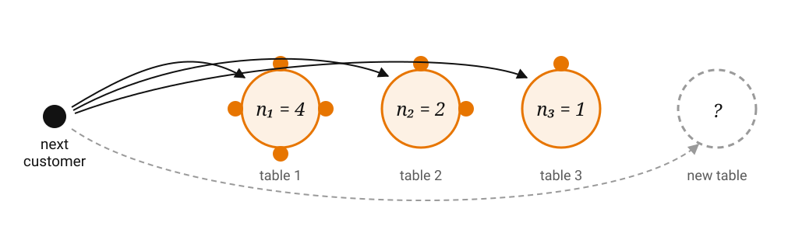
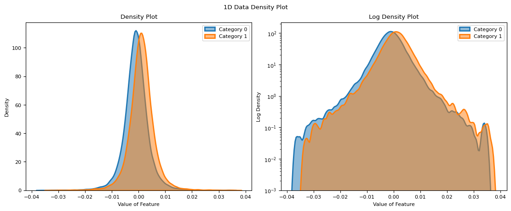
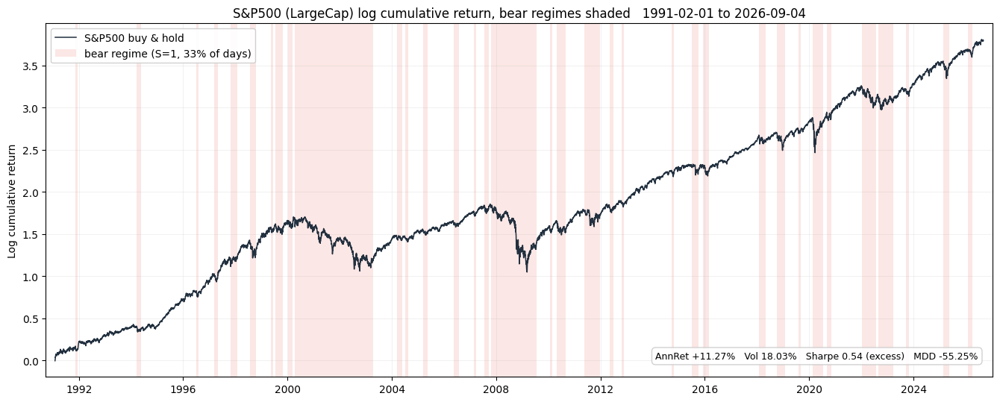
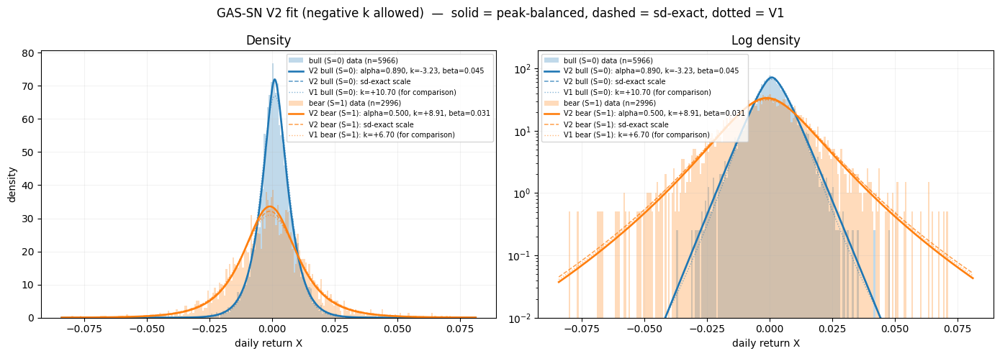

<!-- _class: lead -->

# The Fractional Distribution and Tilted Stable Law

## From the Chinese Restaurant to Synthetic Regime Data

**Two foundational elements in stochastic theory**
**The fractional distributions that we can train regime models on**

## Stephen Lihn (2026)

<span class="small">Source: *Fractional Distributions* (fracdist), Ch. 1.2, 6, 7, 12, 13<br>Reference implementation: `github.com/slihn/(gas-impl, Mixture-VAE)`</span>

###  v87

---

## The challenge

Financial time series is often not long enough for machine learning models.
We need to use **synthetic** data for pre-training.

Challenge of the existing data generator:

- Gaussian emissions make the problem **too easy** — every model wins.
- Student-*t* gives fat tails, but only **one** knob (df) and **no skew**.
- When tails are **too fat**, we need to clip the tails (clip_factor).

---

## Why this talk

The fractional distribution is a reparameterized three-parameter **tilted stable law** $T_{\alpha,\beta}^{-\gamma}$ — 
The law arises as the $\alpha$-diversity limit of the Pitman–Yor process. So the random variate and its PDF rest on a **solid stochastic process**, not on a convenient functional form: the tails, the moments and the sampler are all consequences of that one object.


**GAS-SN** is the new two-sided distribution for return simulation. It gives three independent knobs — $\alpha$ (stability/tail), $k$ (degrees of freedom), $\beta$ (skew). 

- It is more flexible than a truncated Student-*t* ($\alpha=1$, $\beta=0$).
- It converges to the skew-normal distribution naturally: $k \to \infty$, $\alpha \to 2$.

We benchmark regime-detection models — Mixture-VAE, Jump, KMeans++, Gaussian-HMM — on **synthetic** data, generated by **GAS-SN**, mixed by two-state HMM, with known regime labels $S_t$.

---

## Roadmap

1. The **two-parameter tilted stable law** $T_{\alpha,\beta}$ and its Pitman–Yor origin — §1.2
2. The **three-parameter tilted stable law** $T_{\alpha,\beta}^{-\gamma}$: one element, eight distributions
3. The **fractional gamma**, and why it *is* the tilted stable law — Ch. 6
4. **Kanter's method**: how we actually sample it — Lemma 6.2
5. **GAS-SN**: the selective sampling is the second element — Ch. 7, 12
6. From random variates to **synthetic regime data**: `generate_hmm_data(gassn)`
7. **Regime-detection** on synthetic global regime data
8. **Appendix**: Mass tests on pre-training synthetic two-state data, `GAS_SN_Comparator`

---

## The two-parameter tilted stable law

It arose from Pitman & Yor's study of the **Poisson–Dirichlet** distribution. 

$$T^{-\alpha}_{\alpha,\beta} = \left(T_{\alpha,\beta}\right)^{-\alpha}$$

- $\alpha \in [0,1]$ — the **stability index**
- $\beta \ge 0$ — the power of the **polynomial tilt**
- $L_\alpha := T_{\alpha,0}$ — the stable law with no tilt, often characterized by the Laplace transform:

$$\mathbb{E}\left[e^{-t L_\alpha}\right] = e^{-t^{\alpha}}, \qquad t \ge 0.$$

The polynomial tilt $\beta$ is added to the density $L_\alpha(x)$ of $L_\alpha$ as

$$f_{T_{\alpha,\beta}}(x) \thickspace \propto\thickspace x^{-\beta} L_\alpha(x), \qquad x>0.$$

---

## Where it comes from - the single-parameter model

### The Chinese restaurant process (CRP), one customer at a time

Given $\alpha \in [0,1]$, $K_n$ tables occupied after $n$ customers; $n_j$ customers already at table $j$:

- Choose a large table to join? $\Pr(\text{join table } j) = (n_j - \alpha) / n$ $\longrightarrow$ Preferential attachment.
- Open a new table? $\Pr(\text{new table} \mid K_n) = \alpha K_n / n$ $\longrightarrow$ Diversity, creativity (or anti-social).
- The **$\alpha$-diversity limit** is $\frac{K_n}{n^{\alpha}} \longrightarrow M_{\alpha} := L^{-\alpha}_{\alpha}$ (the inverse stable law)



---

## The two-parameter Pitman-Yor process in CRP representation

$K_n$ tables occupied after $n$ customers; $n_j$ customers already at table $j$:

$$\Pr(\text{join table } j) = \frac{n_j - \alpha}{\beta + n}, \qquad
\Pr(\text{new table} \mid K_n) = \frac{\beta + \alpha K_n}{\beta + n}$$

- $\alpha$ plays a **discount** role — larger $\alpha$ discounts the pull of existing tables.
- $\beta$ is a **baseline strength** for creating a new table, independent of $n$ and $K_n$.

The **$\alpha$-diversity limit** is:

$$\frac{K_n}{n^{\alpha}} \longrightarrow T^{-\alpha}_{\alpha,\beta}$$

(Combinatorial Stochastic Processes, Pitman, 2002)

---

## The three-parameter tilted stable law: $\mathrm{TS}(\alpha,\beta,\gamma)$

The superscript (exponent) is generalized to $T^{-\gamma}_{\alpha,\beta}$ with $\gamma \in \mathbb{R}$ in Devroye (2009):

$$\mathrm{TS}(\alpha, \beta, \gamma) \thickspace :=\thickspace T^{-\gamma}_{\alpha,\beta} = (T_{\alpha,\beta})^{-\gamma}$$

- $\gamma > 0$ — represents a **local time** process
- $\gamma < 0$ — represents a **volatility** process

The **bridge** to the fractional distribution -
> "This three-parameter distribution law is **identical to our fractional gamma distribution** with a different parameterization."

---

## One foundational element, eight one-sided distributions

### $T_{\alpha,\beta}^{-\gamma}$ is the foundational **element** that builds all one-sided distributions.


| Fractional distribution | §     | Notation | $\alpha$ | $\beta$ | $\gamma$ | scale |
|---|---|---|---|---|---|---|
| One-sided stable | 4.2 | $L_\alpha$ (aka $T_{\alpha,0}$) | $\alpha$ | 0 | $-1$ | 1 |
| M-Wright / Mittag-Leffler | 3.4 | $M_\alpha$ | $\alpha$ | 0 | $\alpha$ | 1 |
| **Fractional gamma** | 6.5 | $N_\alpha(\sigma,d,p)$ | $\alpha$ | $\alpha d/p$ | $\alpha/p$ | $\sigma$ |
| **Fractional chi (FCM)** | 7.2.1 | $\chi_{\alpha,k}$, $k>0$ | $\alpha/2$ | $(k{-}1)/2$ | $1/2$ | $\sigma_{\alpha,k}$ |
| Inverse FCM | 9.4 | $\chi^{\dagger}_{\alpha,k}$ | $\alpha/2$ | $(k{-}1)/2$ | $-1/2$ | $\sigma^{-1}_{\alpha,k}$ |
| Characteristic FCM | 7.4.2 | $\chi_{\alpha,-k}$ | $\alpha/2$ | $k/2$ | $-1/2$ | $\sigma^{-1}_{\alpha,k}$ |
| FCM2 | 7.5.1 | $\chi^2_{\alpha,k}$ | $\alpha/2$ | $(k{-}1)/2$ | $1$ | $\sigma^2_{\alpha,k}$ |
| Characteristic FCM2 | 7.5.1 | $\chi^2_{\alpha,-k}$ | $\alpha/2$ | $k/2$ | $-1$ | $\sigma^{-2}_{\alpha,k}$ |


* In the last line: $\chi^2_{\alpha,-k}$ is inverse of $T_{\alpha/2,k/2}$. The reparametrization is most obvious here.

---

## FG: The fractional gamma — Overview (Ch. 6)

$$N_\alpha(x;\sigma,d,p) \thickspace :=\thickspace C\left(\frac{x}{\sigma}\right)^{d-1} F_\alpha\negthinspace \left(\left(\frac{x}{\sigma}\right)^{p}\right), \qquad x \ge 0$$

where $F_\alpha(x) := W_{-\alpha,0}(-x) = \alpha x M_\alpha(x)$ is the Wright function of the second kind.

- $\alpha \in [0,1]$ — shape of the Wright function
- $\sigma$ — scale; $p$ — tail shape ($p \neq 0$, $dp \ge 0$); $d$ — degrees of freedom

**FG is the fractional extension of the generalized gamma** $\text{GG}(a,d,p)$: replacing $e^{-(x/a)^p}$ by the Wright function $F_\alpha((x/\sigma)^p)$. GG is recovered at $\alpha = 0$, and — more usefully — at $\alpha = \tfrac12$, which is the line that "leads to the fractional extension of the $\chi$ distribution."

$$C = \frac{|p|}{\sigma}\thinspace \frac{\Gamma(\alpha d/p)}{\Gamma(d/p)} \quad (\alpha \neq 0,\thinspace d \neq 0)$$

---

## FG *is* the tilted stable law (§6.5)

### The FG random variable is exactly the re-parametrized tilted stable variable.

Let $X \sim N_\alpha(\sigma,d,p)$. Then

$$\boxed{\thickspace X = \sigma\thinspace T^{-\alpha/p}_{\alpha,\thickspace \alpha d/p}\thickspace }$$

i.e. $\thickspace \beta = \alpha d/p\thickspace$ and $\thickspace \gamma = \alpha/p$.

This is the most important finding of the work. Everything downstream — FCM, FCM2, fractional $F$, GSaS, GAS-SN — inherits both its **analytics** (Mellin transform, moments) and its **sampler** from this one line.

---

## Sampling by modified Kanter's method (Lemma 6.2)

$$T_{\alpha,\beta} = A_\alpha(Q_\beta)\thinspace G_\beta^{-c}, \qquad c = \frac{1-\alpha}{\alpha}$$

1. $A_\alpha(q)$ — the **Zolotarev function**
2. $Q_\beta$ — the tilted angle, with density on $(0,1)$
$$f_{Q_\beta}(q) = I_\beta A_\alpha(q)^{-\beta}, \qquad I_\beta = \frac{\Gamma(1+\beta)\Gamma(1+c\beta)}{\Gamma(1+\beta/\alpha)}$$

3. $G_\beta \sim \mathrm{Gamma}(1 + c\beta,\ \text{scale}=1)$

Then the inverse variable $U$, and the FG variable $X$, are

$$U = T^{-\alpha}_{\alpha,\beta} = A_\alpha(Q_\beta)^{-\alpha}\thinspace G_\beta^{\thinspace 1-\alpha}, \qquad X = \sigma\thinspace U^{1/p}$$

**Two draws and a closed-form transform. No numerical CDF inversion. Fast.**

---

## FCM: The fractional $\chi$-mean (Ch. 7)

$$\chi_{\alpha,k}(x) := N_{\alpha/2}\big(x;\ \sigma = \sigma_{\alpha,k},\ d = k-1,\ p = \alpha\big), \qquad
\sigma_{\alpha,k} = \frac{|k|^{1/2 - 1/\alpha}}{\sqrt{2}}$$

Apply $\beta = \alpha d/p$, $\gamma = \alpha/p$ with $\alpha \to \alpha/2$, $d = k-1$, $p = \alpha$:

$$\boxed{\thickspace \chi_{\alpha,k} = \sigma_{\alpha,k}\thinspace T^{-1/2}_{\alpha/2,\ (k-1)/2}\thickspace }\qquad \text{(Sec. 7.2.1)}$$

which is exactly **the FCM row of Table 1**. 

Note $\alpha \in (0,2)$ here, while the element $T$ needs $\alpha \in (0,1)$ — the halving $\alpha \to \alpha/2$ is what reconciles them.

---

## The second element: Selective sampling

One-sided elements give tails. **Skewness needs a second mechanism** (§1.2, §14.4).

Take $X_0 \sim N_d(0,\bar\Omega)$, $X_1 \sim N(0,1)$, skew parameter $\beta \in \mathbb{R}^d$. 
The skew-normal (SN) variable is (Azzalini (2013))

$$Z = \begin{cases} X_0 & \text{if } X_1 > \beta^{\intercal} X_0 \cr -X_0 & \text{otherwise} \end{cases}
\qquad\Longrightarrow\qquad Z \sim SN_d(0,\bar\Omega,\beta)$$

A two-sided distribution is assembled as a **ratio** $Z / \mathrm{TS}(\cdot)$ or a **product** $Z \times \mathrm{TS}(\cdot)$.

The **crown jewel** is the skew multivariate elliptical distribution, based on the ratio

$$SN_d(0,\bar\Omega,\beta)/\chi_{\alpha,k}.$$

---

## GAS-SN: The univariate two-sided skew distribution (Ch. 12)

Definition 12.1: Let $Z \sim SN(0,1,\beta)$ and $V \sim \chi_{\alpha,k}$. Then

$$\boxed{\thickspace X = Z / V \thickspace \sim\thickspace L_{\alpha,k}(\beta)\thickspace }$$

$$L_{\alpha,k}(x;\beta) = 2\int_0^\infty \mathcal{N}(xs)\thinspace \Phi_{\mathcal N}(\beta x s)\thinspace \chi_{\alpha,k}(s)\thinspace s\thinspace ds$$

It is a **continuous Gaussian mixture** — one normal per value of the mixing variable $V$.

What it subsumes:

| Limit | Reduces to |
|---|---|
| $\beta = 0$ | GSaS $L_{\alpha,k}$ — the symmetric case |
| $\alpha = 1$ | Azzalini's **skew-$t$**: $T(\beta,k) = L_{1,k}(\beta)$ |
| $\alpha \to 2$ or $k \to \infty$ | the normal distribution $\mathcal{N}(0,1)$ |

$\alpha$ and $k$ control the tail **independently** — that is the modelling gain over Student-*t*.

---

## The full sampling chain in GAS-SN

The python library is built according to the structure laid out above:

```
GAS_SN(alpha, k, beta, loc, scale).rvs(size)
   └─ GAS_SN_Std._rvs:      z0 = SN_Std(beta)._rvs(size)      # selective sampling
                            v  = fcm.rvs(size)                # the one-sided element
                            return z0 / v                     # Definition 12.1

        └─ fcm = frac_chi_mean(alpha, k)  ->  frac_gamma(alpha/2, sigma_ak, k-1, alpha)

             └─ fractional_gamma_gen._rvs  ->  kanter_rvs     # Kanter's method in Devroye (2009)

                  └─ get_tilted_stable3(alpha, beta=alpha*d/p, gamma=alpha/p)
                       └─ TitledStable3.rvs:   exp( c*gamma*log(E) - gamma*log A_alpha(Q) )
```

The `rvs` generator is *not* the bottleneck in the benchmark anymore.

- $X$: 100,008 GAS-SN draws in 0.06 s. Very fast.

---

## From variates to to synthetic regime data

Yuqi's Mixture-VAE code base:

`data_code/synthetic_data.py :: generate_hmm_data(emission_dist='t', clip_factor= ...)`

**Goal:** The state labels are encrypted in the synthetic data via HMM. Model's job is to rediscover the labels.



---

## Mixture-VAE code base

1. **State path.** An `hmmlearn` `CategoricalHMM` with `emissionprob_ = I` emits the hidden path $\lbrace S_t\rbrace$ directly. E.g. Transition matrix `[[0.96, 0.04], [0.04, 0.96]]`, regimes persist ~25 days.
2. **Emissions** are **i.i.d. within a state** per state, at $\pm\text{loc}$.
4. **Draw per state.** For each state, draw exactly $\lvert\lbrace t : S_t = j\rbrace\rvert$ values — vectorized, in chunks.
5. **Clip by rejection.** Samples outside $\text{loc} \pm$ `clip_factor` $\times$ **scale** are rejected and redrawn.

**Why clip:** Undefined moments in small df for Student-*t*. Yuqi used `clip_factor=10.0`.

### **GAS-SN Enhancement** 

* `generate_hmm_data(emission_dist='gassn')` at `https://github.com/slihn/Mixture-VAE`


---

## Cluster distance — between the two states

$$\text{cluster distance} = \frac{|\mathrm{median}_1 - \mathrm{median}_0|}{\mathrm{MAD}},$$

$$\text{where} \quad \mathrm{MAD} = 1.4826\thinspace \mathrm{median}\big(|x - \mathrm{median}(x)|\big).$$

A better measure of the separation between the two states. It is like the loc/sd, but built from medians — It always exists, and **fat tails cannot move it**. 

Rationale: Inside Yuqi's code, $X$ is z-scored before building a feature, so **only the ratio reaches the model**.

---

## Global regime - Bull/bear states by the jump model

Use the jump model to label the bull/bear states in the S&P500 daily return, $8{,}962$ days, $1991$–$2026$.

<table class="layout"><tr><td width="34%">

**Transition**

$$\begin{pmatrix}0.9940 & 0.0060\cr 0.0116 & 0.9884\end{pmatrix}$$

stationary $(0.659,\thinspace 0.341)$

$\mathbf{35}$ **bear episodes** over $\mathbf{35}$ years

</td><td width="66%">



</td></tr></table>


---

## Global regime - GAS-SN fits

**Emission probability** — one GAS-SN per state. Two versions of the fit are used to demonstrate the **negative-$k$** branch:

* positive-$k$: generalized $\alpha$-stable
* negative-$k$: generalized exponential power (thinner tails)

The difference in the bull state fit is more obvious. The negative-$k$ fit matches the peak density to $+0.08$%, where the positive-$k$ fit was $10.9$% low.

| state | fit | $\alpha$ | $k$ | $\beta$ | scale | loc | sd | $\kappa$ |
|---|---|---|---|---|---|---|---|---|
| **bull** ($S=0$), $66.6$% | V1 | $0.703$ | $10.70$ | $0.053$ | $0.00984$ | $+0.00084$ | $0.00722$ | $1.86$ |
| | **V2** | $0.89$ | $\mathbf{-3.23}$ | $0.045$ | $0.00536$ | $+0.00089$ | $0.00722$ | $1.86$ |
| **bear** ($S=1$), $33.4$% | V1 | $0.704$ | $6.70$ | $0.033$ | $0.01984$ | $-0.00119$ | $0.01672$ | $5.40$ |
| | **V2** | $0.50$ | $8.91$ | $0.031$ | $0.04556$ | $-0.00117$ | $0.01672$ | $5.41$ |

---

## Global regime - daily return histogram vs theoretical from fits



Simulating from the fits reproduces the real series on share and scale — bear share $0.337$ vs $0.334$.

<small>Pooled $\kappa$ is $8.42$ (V2) and $9.96$ (V1) vs $10.77$, but that gap is **finite-sample noise, not a defect of either fit**: the bear state's 4th moment rides on a handful of extreme draws, and one fit returns $\kappa$ anywhere from $4.1$ to $8.1$ across draws.</small>

---

## Global regime - model output

$$\textbf{Cluster distance is only } 0.254 \textbf{ MAD — yet Jump scores } 0.92.$$

Feeding those emissions and that transition matrix through the same comparator, $T = 100{,}008$:

| model | **V2** | V1 |
|---|---|---|
| **Jump** | $\mathbf{0.9246}$ | $0.9117$ |
| Mixture-VAE | $0.8613$ | $0.8536$ |
| KMeans++ | $0.8269$ | $0.8145$ |
| Gaussian-HMM | $0.5000$ | $0.5006$ |

- All three ML models score very high.
- **HMM fails outright** ($0.5000$, "model is not converging"), rather than merely trailing.
- Jump ran at `jump_penalty` $=100$ to match the original notebook.
- Emissions clipped at $\pm 20$ **sd**. So V1 and V2 are a controlled comparison.
- V2 lifts all three working models by $\approx 0.01$, tracking its larger cluster distance ($0.254$ vs $0.246$).


---

## Summary on global regime

- Used the jump model to label the bull/bear states since 1991. $35$ bear episodes.
- Fit each state with GAS-SN. Two versions are provided.
- Used GAS-SN as the emission distribution to generate synthetic data.
- Ran four models (Jump, KMeans++, Mixture-VAE, HMM) to label the synthetic data.
- ML model accuracy is high. Jump stands out at $0.92$. HMM fails at $0.50$.
- A smaller cluster distance is not an obstacle.

$$\textbf{These states separate by scale, in addition to opposite locations.}$$

---

## Appendix: Refitting Yuqi's three-model comparison with GAS-SN

- GAS-SN admits a large variety of distribution shapes
- The benchmark (one point) and the sweep ($40{,}000$ points)
- Discovered the two-term law ($a + b \thinspace \kappa$) to measure model efficacy
- Refined the law with $\alpha, k$ dependency
- Model strength is subtle in the sweep data
- The data shows that hyper-parameter choice matters for model performance

---

## `GAS_SN_Comparator` — Large scale model efficacy test

`compare/gassn.py` — the whole experiment as one object:

```python
cmp = GAS_SN_Comparator(
    T=100008, D=1, num_states=2, stay_prob=0.96,
    alpha=1.1, k=2.75, beta=0.0,      # the GAS-SN knobs
    loc=0.001, scale=0.003, clip_factor=12.0,
    window_size=500, batch_size=32, vae_epochs=500,
    jump_penalty=100.0,               # per-model knobs -- also swept
    feature_set='all',                # 'all' 15 | 'means' 6 | 'scales' 8
    seed=42,                          # states, Kanter draws, weight init, shuffle
)
cmp.cluster_distance();  cmp.stats();  cmp.compare()
```

`generate` → `dataloaders` → `fit_{vae,jump,kmeans,hmm}` → balanced accuracy, with label-permutation alignment (`utils.metrics.balanced_accuracy` maximizes over all $k!$ label assignments, so a "flipped" clustering is not penalized). $D = 1$ is enforced: the GAS-SN emission path is univariate.

**`compare/sweep.py`** turns *any* of those keywords into a swept axis — one draw shared by every model, resumable, 19-way parallel. ~40k fits are collected from each model.

---

## What `clip_factor` actually clips

```python
# generate_hmm_data: shape = I * scale**2, so diag_std is the scale, not a std
diag_std = np.sqrt(np.diag(shape_))
lower, upper = loc - clip_factor * diag_std, loc + clip_factor * diag_std
```

The clip is still in the **scale** space. When $k$ increases, `clip_factor=12.0` produces:

| $k$ (at $\alpha=1.1$) | 1.5 | 2.0 | 2.75 | 4.0 | 6.0 | swing |
|---|---|---|---|---|---|---|
| clip, in **sd** | **5.5** | 6.3 | 7.2 | 8.2 | **9.0** | $+63$% |
| **cluster distance** | 0.481 | 0.501 | 0.521 | 0.541 | 0.566 | $+18$% |
| excess kurtosis $\kappa$ | 5.60 | 5.71 | 5.20 | 3.16 | 1.68 | $-70$% |

- The 63% change in sd: the sd is tail-driven, so the clip inflates it and $k$ deflates it.
- **Cluster distance** is a much more stable measure
- The models are affected by two factors - cluster distance and $\kappa$.

---

## What the generated data looks like in the benchmark

$T = 100{,}008$, two states at $\mp 0.001$ with scale $0.003$.
$\alpha = 1.1$, $k = 2.75$, $\beta = -0.1$, clip $= 12$, **cluster distance $= 0.522$** (sd 0.006).

| | $n$ | mean | sd | skew | ex-kurtosis $\kappa$ |
|---|---|---|---|---|---|
| all | 100,008 | $-0.000334$ | 0.005000 | $-0.120$ | **5.17** |
| state 0 | ~50,009 | $-0.001333$ | 0.004897 | $-0.131$ | 5.57 |
| state 1 | ~49,999 | 0.000665 | 0.004901 | $-0.126$ | 5.66 |

Averaged over 20 replicates (`seed=rep`). The regime signal is a **mean shift of $\pm 0.001$ against a std of $0.005$** — a signal-to-noise ratio of 0.2. This is deliberately hard.

- Excess kurtosis **5.2** — *after* clipping at $12 \times$ scale $= 0.036$, which is $\approx 7$ **std**, because the heavy tails lift the std to 0.005 from a scale of 0.003. The unclipped law has far heavier tails.
- Skew $\approx -0.12$ because we set $\beta = -0.1$. The estimate is noisy. It is added to test the skewness feature of GAS_SN. 

---

## Results at the benchmark's operating point

Balanced accuracy on the held-out test split, 10 replicates at `seed=rep` — which now pins the state path, the Kanter draws, the VAE's weight init *and* the loader shuffle, so a replicate reproduces end to end:

| model | balanced accuracy (bac) | $p(>0.6)$ | comment |
|---|---|---|---|
| **Mixture-VAE** | **0.651** (sd 0.040) | **0.80** | **works** |
| KMeans++ | 0.571 (sd 0.071) | 0.30 | at chance *on average* |
| Jump | 0.535 (sd 0.063) | 0.10 | at chance |
| Gaussian-HMM | 0.501 (sd 0.002) | 0.00 | `Model is not converging` |

- **Outcomes are bimodal, so only the VAE's mean is a typical outcome.** KMeans lands at 0.51–0.55 in 7 reps and 0.66–0.68 in 3; Jump sits at 0.50–0.52 in 8, with one 0.70. Their means are **mixing proportions** — read $p$, not the mean.
- The VAE is tighter: 0.65–0.69 in 7 reps, 3 low draws at 0.59–0.61.

**This is one point in parameter space.** Next, the law that summarises the sweeps.

---

## Model efficacy — The two-term law for cluster distance **and** tail weight

For each $(\alpha,k, \text{clip})$ cell, take its **cluster distance threshold** $\mathcal{D}$ — where replicate-mean accuracy first reaches the target ($0.65$)— and regress it on that cell's excess kurtosis $\kappa$:

$$\boxed{\thickspace \mathcal{D} \thickspace =\thickspace a \thickspace +\thickspace b \thinspace \kappa\thickspace }$$

- **Intercept $a$:** with Gaussian tails, how many robust widths apart the clusters must sit.
- **Slope $b$:** what one unit of excess kurtosis costs in extra cluster distance.
- **$\alpha$ and $k$ do not disappear into $\kappa$.** The line is a **reduced form, not a sufficient statistic**.

**`clip` and `jump_penalty` are *not* absorbed** — they parameterize the law rather than acting through $\kappa$. Pool over them and $R^2$ falls to $0.48$; pooling all nine (model, `clip`) configs gives $0.56$, against $0.65$–$0.99$ *within* a config.

$$\textbf{A quoted law is } (a, b) \textbf{ plus its target and the } \kappa \textbf{ domain it was fitted over.}$$

---

## Fitting the two-term law: The intercept transfers, the slope does not

Fitting the law **nine times at target $0.65$** — three models $\times$ $3$ `clip` values (`data/vae_sweep.csv`):

| term in $\mathcal{D}$ | mean $\pm$ sd | spread (max $\div$ min) | driven by |
|---|---|---|---|
| intercept $a$ | $0.313 \pm 0.021$ | $1.2\times$ | essentially **independent** of model |
| slope $b$ | $0.057 \pm 0.024$ | $\mathbf{4.1\times}$ | the **$(\alpha,k,\kappa)$ region sampled**, partly the model |

- **$a$ is close to a constant of the problem.** All nine pairs need roughly **a third of a robust width** at Gaussian tails.
- **$b$ is what tails cost** — $0.081 / 0.057 / 0.035$ at clip $8 / 12 / 20$, non-overlapping. Not `clip` setting it, but **which $(\alpha, k, \kappa)$ cells it reaches**. It is also **model dependent**.
- So model choice shows up in *which feature the tail is read through*, in $R^2$ — and, for the VAE, in $b$ itself.

---

## `clip` is not a setting — it selects the $(\alpha, k, \kappa)$ region you sample

All $140$ cells, four `clip` values, one intercept per model; centred at $\alpha=1.6$, $k=6$, `clip`$=12$ (where $\kappa \approx 0.5$):

<table class="layout"><tr><td width="34%">

| term in $\mathcal{D}$ | coef | $t$ | $p$ |
|---|---|---|---|
| Intercept | $\mathbf{+0.318}$ | $+15.8$ | $2\times10^{-32}$ |
| $\kappa$ | $+0.018$ | $+4.8$ | $3\times10^{-6}$ |
| $\alpha - 1.6$ | $\mathbf{-0.200}$ | $\mathbf{-6.0}$ | $\mathbf{2\times10^{-8}}$ |
| $k - 6$ | $\mathbf{-0.035}$ | $\mathbf{-5.4}$ | $\mathbf{3\times10^{-7}}$ |
| `clip` $-\thinspace 12$ | $-0.002$ | $-1.0$ | $0.32$ |

</td><td width="66%">

- **The intercept is the Gaussian-tail threshold**, $\mathbf{0.318}$ — against the law's $a = 0.311$. **The two fits agree.**

- **`clip` is the one term that vanishes.** Over their ranges $\alpha$ moves the threshold $-0.160$ MAD, $k$ $-0.141$, $\kappa$ $+0.165$.

</td></tr></table>


$$\textbf{Quoting a law means naming } (\alpha, k, \kappa)\textbf{, not the } \texttt{clip} \textbf{ that reached them.}$$

<small>*Source: `data/vae_sweep.csv` + `data/vae_sweep_clip18.csv`; $6{,}912$ fits, $140$ threshold cells.*</small>

---

## Why the slope never transferred — the two-term law is a *projection*

$\kappa$ summarises what $(\alpha, k)$ generate, so regressing on it **alone** leaves them in the error term, reabsorbed into $b$ as omitted-variable bias. All $140$ cells, **all three models pooled**, one intercept per model:

<table class="layout"><tr><td width="45%">

$$b_{\text{marginal}} \thickspace =\thickspace \underbrace{b_\kappa}_{\substack{\text{partial:}\cr \alpha,\thinspace k\ \text{held fixed}}} \thickspace +\thickspace b_\alpha\thinspace \delta_\alpha \thickspace +\thickspace b_k\thinspace \delta_k \thickspace \thickspace \thickspace \thickspace$$

</td><td width="55%">

| `clip` | $\delta_\alpha$ | $\delta_k$ | predicted $b$ | observed $b$ |
|---|---|---|---|---|
| $8$ | $-0.230$ | $-0.414$ | $0.0823$ | $\mathbf{0.0796}$ |
| $12$ | $-0.111$ | $-0.345$ | $0.0533$ | $\mathbf{0.0571}$ |
| $18$ | $-0.053$ | $-0.226$ | $0.0360$ | $\mathbf{0.0378}$ |
| $20$ | $-0.045$ | $-0.192$ | $0.0329$ | $\mathbf{0.0330}$ |

</td></tr></table>

**Every config to within $\pm 0.004$**, from one pooled fit. The confounding is the *systematic* part: marginal $b$ falls **monotonically** $0.080 \to 0.033$, while partial $b_\kappa$ shows **no trend** ($0.025 / 0.014 / 0.027 / 0.026$). The $2.4\times$ spread was $\alpha$ and $k$ leaking in.

$$\textbf{The intercept was never confounded. The slope always was.}$$

---

## `jump_penalty` — the price of a regime change

The Jump model's `jump_penalty` $\lambda$ is a **flat cost per switch**, a persistence prior priced in squared error. At **$\lambda \to 0$** the Jump model ***is* KMeans** ($0.0008$ bac apart, $\mathrm{corr}\thinspace 0.9990$); at **$\lambda \to \infty$** it collapses to one state.

| $\lambda$ | $0.03$ | $0.3$ | $3$ | $\mathbf{30}$ | $100$ |
|---|---|---|---|---|---|
| mean bac | $0.7022$ | $0.7030$ | $0.7116$ | $\mathbf{0.7333}$ | $0.6888$ |
| mean threshold $\mathcal{D}$ | $0.487$ | $0.487$ | $0.475$ | $\mathbf{0.431}$ | $0.517$ |

**The optimum is $30$ in all eleven slices** — every $k$, $\alpha$ and `clip`. A constant to set once, not tuned. Paired, $\lambda=30$ beats $100$ by $\mathbf{+0.0445}$ bac ($t = 43.3$).

$$\textbf{Every Jump number in this deck was run at } \lambda = 100 \textbf{ — the worst of the five.}$$

<small>*Source: `data/jump_sweep.csv` — $19{,}200$ Jump fits over $5$ penalties.*</small>

---

## KMeans++ — never a capability problem

**40,960 fits** (`data/kmeans_sweep.csv`): `loc` $\times\ \alpha\ \times k\ \times$ `clip` $\times$ **feature set**, 20 replicates each.

| feature set | $p(\text{bac}>0.65)$ | mean bac | max bac |
|---|---|---|---|
| 6 rolling **means** | **0.85** | 0.731 | 0.870 |
| all 15 | 0.75 | 0.702 | 0.877 |
| 8 **scale** features | **0.000** | 0.505 | **0.524** |

The scale features are the control: signal-free by construction — the states differ only in `loc`, never in scale — and across 10,240 fits not one exceeded $0.524$. So the failure is the wrong **axis**, not too many features.

$$\textbf{Restricted to the six means: } p(\text{bac}>0.65) = 1.00 \textbf{ at every } loc \ge 0.0010,\ \textbf{all } \alpha,\thinspace k,\thinspace \text{clip}$$

`clip` bites only while a scale axis survives: at the preset it runs $0.35 \to 0.95$ across clip $10\to20$ for all-15, and is **flat** for the means — unchanged whether read at $0.60$ or $0.65$.

---

## The three laws, side by side — one sweep, one draw per cell

| model | $\mathcal{D} = a + b\thinspace \kappa$ &nbsp;(target $0.65$, $\kappa$ to $8.5$) | $R^2$ |
|---|---|---|
| **Mixture-VAE** | $\mathbf{0.333} + \mathbf{0.0500}\thinspace \kappa$ | 0.78 |
| Jump | $0.311 + 0.0609\thinspace \kappa$ | **0.99** |
| KMeans++ | $\mathbf{0.281} + 0.0607\thinspace \kappa$ | 0.65 |

**The VAE trades the worst intercept for the shallowest slope** — more separation at Gaussian tails, less extra per unit of kurtosis.

- $a$: what the model needs when tails are Gaussian. KMeans is cheapest here, the VAE dearest.
- $b$: what each unit of kurtosis costs. The VAE's $0.050$ against $0.061$ for both baselines — **$18$% shallower**.
- $R^2$: how completely $\kappa$ *alone* predicts the threshold — how **threshold-like** the model is.

<small>*Source: `data/vae_sweep.csv` at `clip`$=12$, one draw per cell.* Jump's law here reproduces the penalty sweep's $0.312 + 0.0594\kappa$ on a different grid — agreeing to $0.3$% on $a$, $2$% on $b$. **The framework replicates.**</small>

---

## So the ranking of three models is not fixed — it crosses

As $\kappa$ increases, the required cluster distance $\mathcal{D}$ at target $0.65$, `clip` $=12$, from the three laws on the previous slide (`data/vae_sweep.csv`):

| $\kappa$ | VAE | Jump | KMeans | needs least $\mathcal{D}$ |
|---|---|---|---|---|
| 0 | 0.333 | 0.311 | **0.281** | KMeans |
| 3 | 0.483 | 0.494 | **0.463** | KMeans |
| 5 | **0.583** | 0.616 | 0.584 | **VAE** |
| 8 | **0.733** | 0.798 | 0.766 | **VAE** |

$$\textbf{The VAE overtakes Jump at } \kappa = 2.04\textbf{, and KMeans at } \kappa = 4.93.$$

For scale, the benchmark's own $\kappa$ runs $1.6$ at $k=6$ to $5.3$ at $k=2$; across the sweep the median is $3.0$ and the **top-5% average is $15.9$**. Both crossovers therefore sit **inside** the swept range, not off at its edge — which is why the earlier single-point readings disagreed with each other.

---

## Summary — one law, three models, and what actually separates them

- **Jump** fits the law best ($R^2 = 0.99$) yet fails most often ($33$% of the grid).
- **KMeans++** needs the least separation at Gaussian tails, and is the least threshold-like ($R^2 = 0.65$).
- **Mixture-VAE** has the dearest intercept and the shallowest slope — and one third the failure rate.
- **$a$ is nearly a constant of the problem, $b$ is not** — $b$ is a *projection* coefficient over the $(\alpha,k,\kappa)$ region you measured.
- The baselines fail for **unrelated** reasons: Jump's m-step means take in outliers; KMeans splits on a signal-free axis.

$$\textbf{The VAE does not separate regimes better. It fails three times less often.}$$

<small>**Every "dominant knob" here turned out to be local** — real where first measured, absent on the full grid: the $k=4$ reversal, *KMeans needs* `clip` $\ge 16$, *the VAE caps at $0.70$*.</small>

---

## What the VAE actually buys — not accuracy, but a floor

Over all **1,728 fits per model** (`data/vae_sweep.csv`), the *means* are within two points of each other:

| model | mean bac | sd | $p(\text{bac}>0.6)$ | $\mathbf{p(\text{bac}<0.55)}$ | IQR |
|---|---|---|---|---|---|
| **Mixture-VAE** | 0.689 | **0.093** | **0.78** | **0.11** | **0.144** |
| KMeans++ | 0.683 | 0.118 | 0.72 | 0.28 | 0.257 |
| Jump | 0.673 | 0.123 | 0.66 | 0.33 | 0.265 |

$$\textbf{Same average accuracy. One third the failure rate.}$$

- The VAE lands near chance on **11%** of the grid; the baselines on **28–33%**. Its inter-quartile range is **44% narrower**.
- **"The ranking reverses at $k=4$" does not survive the full grid** — at `clip` $=12$ accuracy tracks within 2–3 points at *every* $k$. An artifact of reading one `loc`.
- What differs between these models is not where they peak. It is **how often they collapse** — which is exactly what a shallower slope buys.

---

## Provenance — which sweep backs which claim

<!-- _class: nowrap -->

| CSV | fits | models $\times$ reps | swept | **pinned** |
|---|---|---|---|---|
| `vae_sweep.csv` | $5{,}184$ | $3 \times 6$ | `loc`(8) $\alpha$(3) $k$(4) `clip`(8,12,20) | $\lambda=100$, `features=all` |
| `vae_sweep_clip18.csv` | $1{,}728$ | $3 \times 6$ | `loc`(8) $\alpha$(3) $k$(4) | `clip`$18$, $\lambda100$, `all` |
| `jump_sweep.csv` | $23{,}040$ | jump+kmeans $\times\ 10$ | `loc`(8) $\alpha$(4) $k$(4) `clip`(8,12,20) **$\lambda$(5)** | `features=all` |
| `kmeans_sweep.csv` | $40{,}960$ | kmeans $\times\ 20$ | `loc`(8) $\alpha$(4) $k$(4) `clip`(10,12,16,20) **`features`(4)** | — |
| `jump_loc_sweep` + `jump_moments` | $1{,}760$ | jump $\times\ 10$ | `loc`(11) $\alpha$(4) $k$(4) | `clip`$=12$, $\lambda=100$ |

$$\textbf{Each model's own knob is pinned at its default in every file except the one that studies it.}$$

<div class="small">

- $\lambda = 100$ everywhere but `jump_sweep.csv` — the **worst** of the five, so every headline Jump score **understates Jump by $\approx 0.045$ bac**.
- `feature_set = all` everywhere but `kmeans_sweep.csv` — **understating KMeans by $0.031$ bac** against `means_x`.
- The VAE's own knobs (`lamda_t`$=4.0$, `vae_epochs`$=500$) are pinned in **every** file — never swept, at $274$ s/fit.

</div>

---

## References

- **fracdist** — *Fractional Distributions*, Ch. 1.2 (elements & Table 1), Ch. 6 (FG and the inverse tilted stable law), Ch. 7 (FCM), Ch. 12 (GAS-SN). `github.com/slihn/gas-impl/tree/main/docs`
- Pitman & Yor — Poisson–Dirichlet, the two-parameter CRP, and the $\alpha$-diversity limit.
- Devroye / Kanter / Zolotarev — the stable-law sampling representation behind Lemma 6.2.
- Azzalini (2013) — the skew-normal and skew-$t$ blueprint (selective sampling, $SN_d$).
- Nie, Mulvey, Poor, Yu & Huang (2026) — *Deep generative models meet statistical methods: a generalized framework for financial regime identification*, **Annals of Operations Research** (in press). Code: `github.com/yuqinie98/Mixture-VAE` — the model and benchmark this work builds on.

